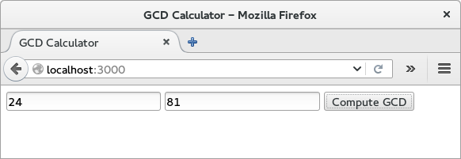
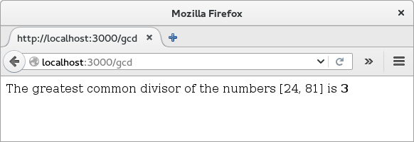
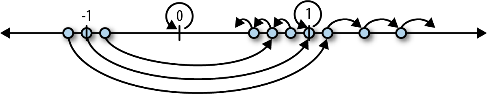
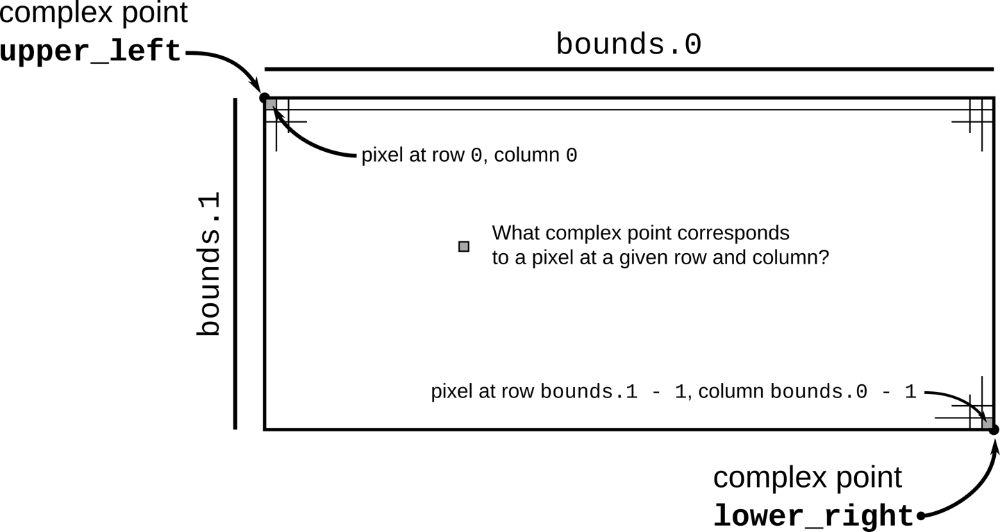
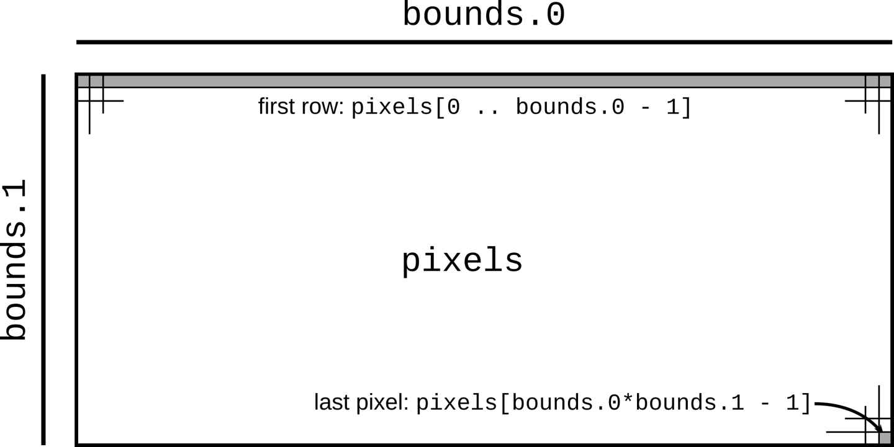
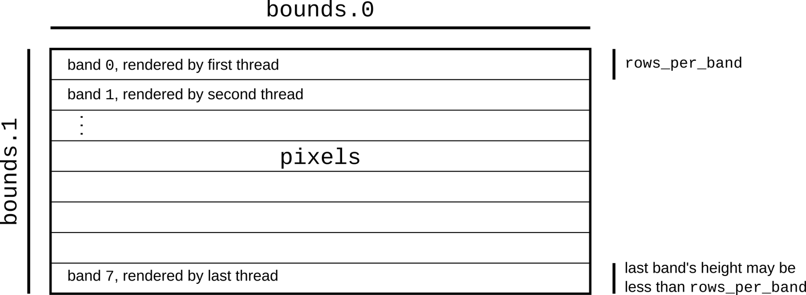

# 第2章. RUST之旅

### 第2章

## RUST之旅

_Toute l’expérience d’un individu est construit sur le plan de son langage._ 

_\(An individual’s experience is built entirely in terms of his language.\)_

       __—Henri Delacroix

 在本章中,我们将讨论几个小程序,以了解RUST的语法、类型和语义是如何组合在一起以实现安全、并发和高效的代码。我们先看看怎么下载和安装RUST，然后再看几个简单的数学方面的代码，接着尝试一个基于第三方库的web服务程序， 最后使用多个线程加速绘制曼德布洛特集合的过程。

### 下载和安装RUST

安装RUST最好的方法是使用rustup和rust installer，可以访问[https://rustup.r](https://rustup.rs) 网址，查看安装说明，跟着一步一步的做就可以了。

你也可以访问[https://www.rust-lang.or](https://www.rust-lang.org) 网站，点击下载，可以获得Linux，macOS和Windows不同平台的安装包。RUST已经有一些操作系统的分发包。我们更喜欢rustup，因为它是管理RUST安装的工具，它就像Ruby的RVM或Node的VM。当RUST有新版本发布时，你可以输入 rustup update命令一键升级。

不管怎样，你已经完成了安装，在命令行你应当由3条新命令可以使用：

```bash
$ cargo --version
cargo 0.18.0 (fe7b0cdcf 2017-04-24)
$ rustc --version
rustc 1.17.0 (56124baa9 2017-04-24)
$ rustdoc --version
rustdoc 1.17.0 (56124baa9 2017-04-24)
$
```

这里的$是命令行提示符；在window系统里，它是C:/&gt;或者类似的提示符。运行这三条命令行命令，我们要获得每个命令返回已经安装相应程序的版本信息。依次执行每个命令：

* cargo是RUST的编译，包管理器，它是一个通用的工具。你可以用cargo创建一个新项目，编译，运行程序，以及管理程序所依赖的所有外部包。
* rustc是RUST的编译器。通常都是cargo调用rustc，但是有时我们需要直接调用rustc编译代码，满足我们特殊的编译需求。
* rustdoc是RUST的文档工具。如果你在源代码中编写符合格式的注释，rustdoc可以把这些注释生成结构良好的HTML帮助文档。就像rustc一样，我们通常让cargo执行rustdoc。


为了方便，cargo会创建一个基本的可以运行的项目架构，包括一些元数据：

```bash
$ cargo new --bin hello
        Created binary (application) `hello` project
```

这个命令创建了一个新的包目录结构，命名为 hello 这个 --bin参数指示cargo生成一个可执行的程序目录结构，不是一个库文件。看一下生成程序目录的根目录信息：

```bash
$ cd hello
$ ls -la
total 24
drwxrwxr-x. 4 jimb jimb 4096 Sep 22 21:09 .
drwx------. 62 jimb jimb 4096 Sep 22 21:09 ..
drwxrwxr-x. 6 jimb jimb 4096 Sep 22 21:09 .git
-rw-rw-r--. 1 jimb jimb 7 Sep 22 21:09 .gitignore
-rw-rw-r--. 1 jimb jimb 88 Sep 22 21:09 Cargo.toml
drwxrwxr-x. 2 jimb jimb 4096 Sep 22 21:09 src
$
```

我们看到 cargo生成了一个Cargo.toml文件，它包含了程序的元数据。此时这个文件包含了少量的元数据：

```yaml
[package]
name = "hello"
version = "0.1.0"
authors = ["You <you@example.com>"]
[dependencies]
```

如果我们的程序需要依赖其它库，我们可以把依赖信息记录在这个文件里，然后，cargo可以自动为我们根据这文件下载，创建，更新这些库文件。在第8章节，我们将全面详细的讲解Cargo.toml 。

cargo为我们的代码配置了git，包括创建了一个 _.git_ 元数据子目录和一个_.gitignore_文件。 你可以通过在命令行上指定—vcs none参数告诉Cargo跳过这一步。

这个src子目录，包含了RUST的所有代码：

```bash
$ cd src
$ ls -l
total 4
-rw-rw-r--. 1 jimb jimb 45 Sep 22 21:09 main.rs
```

看起来，好像cargo已经为我们写了程序。这个main.rs 文件包含如下内容：

```rust
fn main() {
   println!("Hello, world!");
}
```

在RUST中，你甚至不需要自己写“Hello，world！”代码。这是RUST的样本程序：两个文件，总共9行。

我们可以在程序目录结构中，调用cargo的run命令来编译，运行我们的程序：

```bash
$ cargo run
     Compiling hello v0.1.0 (file:///home/jimb/rust/hello)
     Finished dev [unoptimized + debuginfo] target(s) in 0.27 secs
     Running `/home/jimb/rust/hello/target/debug/hello`
Hello, world!
$
```

这里，cargo调用了RUST的rustc编译代码，然后调用run运行编译的程序。cargo把编译的可执行文件放到工程目录的根目录下的_target_子目录里：

```bash
$ ls -l ../target/debug
total 580
drwxrwxr-x. 2 jimb jimb 4096 Sep 22 21:37 build
drwxrwxr-x. 2 jimb jimb 4096 Sep 22 21:37 deps
drwxrwxr-x. 2 jimb jimb 4096 Sep 22 21:37 examples
-rwxrwxr-x. 1 jimb jimb 576632 Sep 22 21:37 hello
-rw-rw-r--. 1 jimb jimb 198 Sep 22 21:37 hello.d
drwxrwxr-x. 2 jimb jimb 68 Sep 22 21:37 incremental
drwxrwxr-x. 2 jimb jimb 4096 Sep 22 21:37 native
$ ../target/debug/hello
Hello, world!
$
```

当我们完成时，运行cargo的clean命令，可以帮我们清除编译生成的文件：

```bash
$ cargo clean
$ ../target/debug/hello
bash: ../target/debug/hello: No such file or directory
$
```

### 一个简单的函数

RUST的语法并非都是全新的。如果你熟悉C，C++，Java或者Javascript，通过一个RUST程序的代码结构，你会发现你熟悉的语法结构。这个函数计算两个整数的最大公约数，使用欧几里得算法：

```rust
fn gcd(mut n: u64, mut m: u64) -> u64 {
   assert!(n != 0 && m != 0);
   while m != 0 {
      if m < n {
         let t = m;
         m = n;
         n = t;
      }
      m = m % n;
   }
   n
}
```

fn是关键字（发音：fun）声明了一个函数。这里我们定义了一个命名为gcd的函数，这个函数有n和m两个参数，两个参数都是unsigned 64位整数类型。-&gt;在返回类型前面：我们的函数返回一个unsigned 64位整数类型。4个空格的缩进是RUST代码的标准排版。

RUST的整型类型的名字表明了它的大小和符号：i32 表示有符号32位整型；u8表示无符号8位整型（用于‘byte’值），诸如此类。isize和usize类型用于保存有符号指针地址和无符号指针地址，32平台，32位是长整型，64平台，64位是长整型。RUST也有2个浮点类型，f32和f64，它们是IEEE标准的单精度和双精度浮点类型，就像C和C++里的 float和double类型。

默认情况下，一旦一个变量被初始化，它的值就不可以被改变，但是在参数n和m前放置 mut（发音“mute”，是_mutable_的简写）关键字就可以在函数体中改变它们的值。实践中，大部分的变量不需要被改变；mut关键字在我们阅读代码时，可以给我们很好的提示。

这个函数一开始调用 assert!宏，验证两个参数都不是零。！字符表明了它是一个宏调用，不是函数调用。就像C和C++的assert宏一样，RUST的assert！宏检查参数是不是true，如果不是true，就会中断程序的运行，并给出一个友好的信息输出，信息里包含检查失败处的源码位置；这种突然的终止被称作panic。不像C和C++可以跳过检查断言，RUST不论怎么编译的程序，总是检查每一个断言。为了提升编译速度，RUST会跳过debug\_assert!宏断言的检查。

 这个函数的核心是一个while循环，其中包含一个if语句和一个赋值语句。 与C和c++不同，Rust不需要在条件表达式周围使用园括号，但是它的执行语句体需要用大括号。

一个let语句声明了一个局部变量，t就是我们函数体内的局部变量。只要RUST能从使用的上下文中推断出变量的类型，我们并不需要显示的写出它的类型。 在我们的函数中，从上下文中m和n的类型，可以推断唯一适用于t的类型是u64。RUST只推断函数执行体内的变量类型：你必须显示的写出 函数参数和返回值的类型。如果我们想显示的写出t的类型，我们可以这样写：

```rust
let t: u64 = m;
```

RUST有一个返回语句，但是gcd函数并不需要它。如果一个函数体在结束的地方有一个没有以分号结尾的表达式，那这个表达式就是此函数的返回值。事实上，任何一对花括号内都是一个语句块，一个语句块可以作为一个表达式运行的。例如，这是一个表达式，它打印一条消息，然后生成x.cos\(\)作为其值:

```rust
{
    println!("evaluating cos x");
    x.cos()
}
```

在函数结束时，这种确定函数返回值的方式，在RUST中是一种很典型的方式，只有在函数中途需要返回值时，才会显示的使用 return语句。

### 写和运行单元测试

 Rust对语言级别内置的测试提供了简单的支持。 要测试gcd函数，我们可以编写：

```rust
#[test]
fn test_gcd() {
    assert_eq!(gcd(14, 15), 1);
    assert_eq!(gcd(2 * 3 * 5 * 11 * 17,
        3 * 7 * 11 * 13 * 19),
        3 * 11);
}
```

这里，我们定义了一个名叫test\_gcd\(\)的函数，它调用gcd并且验证其返回值的正确性。在函数定义的顶部\#\[test\]标准了此函数是一个测试函数。正常的编译时，可以跳过测试函数，不做编译，当我们用cargo test命令运行程序时，测试函数参与编译而且会自动运行。假设我们已经在本章开始的hello项目中，编写了gcd和test\_gcd两个函数。 如果当前目录位于hello项目的某个子目录，则可以按照以下方式运行测试：

```rust
$ cargo test
    Compiling hello v0.1.0 (file:///home/jimb/rust/hello)
      Finished dev [unoptimized + debuginfo] target(s) in 0.35 secs
        Running /home/jimb/rust/hello/target/debug/deps/hello-2375a82d9e9673d7

running 1 test
test test_gcd ... ok

test result: ok. 1 passed; 0 failed; 0 ignored; 0 measured
$
```

 我们可以让测试函数分散在我们的源代码项目中，放置在它们所执行的代码旁边，cargo测试将自动收集它们并运行它们。

 \#\[test\]注解是众多属性中的一个，属性可以标记函数或者其他声明，就像C++和C\#中的属性或者java中的注解。它们用于编译器的告警和代码样式检查，还包括带条件的代码（例如C和C++中的\#ifdef），带条件的代码可以让RUST知道如何与其他语言编写的代码交互，诸如此类。接下来我们会看到更多带属性的例子。

### 处理命令行参数

 如果我们想让程序将一组数字作为命令行参数并输出它们的最大公约数，main函数可以像如下写：

```rust
use std::io::Write;
use std::str::FromStr;
fn main() {
    let mut numbers = Vec::new();
    for arg in std::env::args().skip(1) {
        numbers.push(u64::from_str(&arg)
        .expect("error parsing argument"));
    }

    if numbers.len() == 0 {
        writeln!(std::io::stderr(), "Usage: gcd NUMBER ...").unwrap();
        std::process::exit(1);
    }

    let mut d = numbers[0];
    for m in &numbers[1..] {
        d = gcd(d, *m);
    }

    println!("The greatest common divisor of {:?} is {}",
    numbers, d);
}
```

这是一大段代码，让我们一部分一部分的看：

```rust
use std::io::Write;
use std::str::FromStr;
```

用use声明关键字引入了 Write和FromStr两个特性。我们将在 第11章节详细介绍RUST的特性，但是现在我们只是简单的介绍一下：一个特性相信对于集合的一个方法，而且集合中的每个元素的类型都实现了这个特性。虽然我们在代码中不用写名字为Write和FromStr的特性或函数，但是特性必须先要用use引入代码域内才能被使用。在目前情况下：

* 实现Write特性的类型都具有write\_fmt方法，这个方法可以把格式化后的文本写入流。std::io::Stderr类实现了Write特性，并且我们使用writeln!宏打印错误信息；这个宏扩展了调用write\_fmt方法的代码。
* 实现FromStr特性的类型都具有from\_str方法，这个方法尝试把一个字符串类型转换成指定类型。u64类型实现了FromStr特性，我们调用u64::from\_str方法，尝试把命令行参数做转换成u64类型。

我们来看看main函数：

```rust
fn main() {
```

我们的main函数并没有一个返回值，因此我们可以简单的省略 -&gt;和返回类型列表。

```rust
let mut numbers = Vec::new();
```

我们声明了一个可修改的局部变量numbers，用一个空的vector初始化它。Vec是RUST中一个可变长的vector数组类型，类似 C++中的std::vector，一个Python 中的list，或者 Javascript 中的array。虽然vector被设计成可以动态增长或收缩的数组，但是在RUST中，我们仍然要标记这个变量为mut可修改，我们才能把数字添加到数组的尾部。

numbers的类型是Vec&lt;u64&gt;类型，也就是成员值为u64类型的vector数组，但是在这个变量的前面我们不需要显示的写出类型。RUST可以为我们推断出numbers的类型，因为我们给numbers添加的成员值都是u64类型的，同时也因为我们要把numbers的成员值传送给gcd函数，而gcd函数只接受 u64类型的参数。

```rust
for arg in std::env::args().skip(1) {
```

 在这里，我们使用for循环来处理命令行参数，依次把每个参数给变量arg赋值，并计算循环体，跳过第一个参数，因为第一个参数是运行程序的名字。

std::env::args 函数返回一个迭代器，这个迭代器会按需要生成每一个参数，并且指示什么时候完成。迭代器在RUST中是普遍存在的；标准库中还包含许多其他迭代器，这些迭代器可以处理vector的成员，读取文件对象的行，接收通讯通道的返回消息和处理几乎所有其他有意义的循环。RUST的迭代器是非常高效的： 编译器通常能够将它们转换成与手写循环相同的代码。 我们将在第15章中展示它的工作原理并给出示例。

 除了使用for循环之外，迭代器还包含大量可直接使用的方法。 例如，std::env::args返回的迭代器生成的第一个值总是正在运行的程序名称。我们需要跳过这个程序名称参数，因此我们可以调用迭代器的skip方法创建一个新的迭代器，这个新的迭代器可以忽略第一个参数。

```rust
numbers.push(u64::from_str(&arg)
             .expect("error parsing argument"));
```

这里，我们调用u64::from\_str尝试把我们的命令行参数arg转换成无符号64位数字， from\_str是一个与u64类型相关联的函数，类似于c++或Java中的静态方法，而不是我们在手边的某个u64值上调用的方法。 from\_str函数不直接返回u64，而是返回一个Result对象，它指示解析成功还是失败。一个Result对象具有2个变量值：

*  写入Ok\(v\)的值，表示解析成功，v是解析成功的值
*  写入Err\(e\)的值，表示解析失败，e是解析失败的原因

执行输入，输出或者其他的与操作系统交互的函数都会返回一个Result对象，它的OK变量指示了成功和成功的结果值，如打开文件等操作，而它的Err变量指示了失败和失败的原因。 与大多数现代语言不同，Rust没有exceptions： 如第7章所述，使用Result或panic处理所有错误。

 我们使用Result的expect方法检查解析是否成功。 如果Result是Err\(e\)， expect将打印包含e描述的错误信息，并立即退出程序。 但是，如果结果是Ok\(v\)， expect只返回v本身，我们最终可以将它添加到vector里。

```rust
if numbers.len() == 0 {
    writeln!(std::io::stderr(), "Usage: gcd NUMBER ...").unwrap();
    std::process::exit(1);
}
```

numbers的len等于0表示没有数字是空数组，它们也没有最大公约数，因此我们要检查vector最少要有一个成员值，如果满足不了条件我们就退出程序并打印错误信息。我们用writeln!宏打印错误到标准的错误输出流， 标准错误输出流由std::io::stderr\(\)提供。调用.unwrap\(\)方法是检查打印错误信息是否失败的简单方式；调用expect也可以实现相同的功能，但是没必要这样做。

```rust
let mut d = numbers[0];
for m in &numbers[1..] {
    d = gcd(d, *m);
}
```

 这个循环使用d作为它的最大公约数值，每次迭代计算更新它使它保持到目前为止我们处理过的所有数字的最大公约数。 和以前一样，我们必须将d标记为可变的，以便在循环中对其赋值。

 for循环有两个神奇的之处。首先，我们写for m in &numbers\[1..\]；这里的&符号是做什么用的？其次，我们写gcd\(d, \*m\)；期中\*m中的\*是做什么用的？这两个符合是互为逆运算。

 到目前为止，我们的代码只对一些简单的值进行操作，比如用于固定大小内存块的整数。 但是现在我们要遍历一个vector，这个vector可以是任意大小——可能非常大。 在处理这些值时，Rust非常谨慎： RUST希望让程序员控制内存消耗，使每个值的生命周期变得清晰，同时仍然确保在不再需要时及时释放内存。

 当我们迭代numbers的时候，我们想告诉Rust vector的所有权应该和numbers保持一致； 我们只是在循环中借用它的成员，而不是获得成员的所有权。&numbers\[1..\]中的&操作符借用vector中从第二个成员开始的引用。这个for循环迭代每个成员的引用， 让m依次借用每个成员。 \*m中的\*运算符解引用m，产生其引用的值；这是我们要传递给gcd函数的u64值。 最后，由于numbers拥有vector，所以在main结束时，当numbers超出作用域时，Rust会自动释放vector。

RUST的所有权和引用规则对RUST管理内存和线程安全是非常关键的，我们在第4章详细讨论它们，在第5章详细讨论引用规则。 你需要适应这些规则才能适应RUST， 但是对于这次介绍性的旅行， 你需要知道的是&x借用了对x的引用，而\*r是解引用r的值。

继续我们这个程序的旅行：

```rust
println!("The greatest common divisor of {:?} is {}",
         numbers, d);
```

 在遍历numbers成员之后，程序将结果打印到标准输出流。 println !宏使用一个模板字符串，将其余参数的格式化后替换{…}在模板字符串中显示，并将结果写入标准输出流。

 与C和c++不同，如果程序成功完成，则需要main返回0，或者如果出现错误，则需要非零退出程序，Rust假设如果main返回，则程序成功完成。 只有通过显式地调用expect或std::process::exit等函数，我们才能使用错误状态代码终止程序。

 cargo run命令允许我们向程序传递参数，这样我们就可以尝试命令行处理：

```rust
$ cargo run 42 56
    Compiling hello v0.1.0 (file:///home/jimb/rust/hello)
     Finished dev [unoptimized + debuginfo] target(s) in 0.38 secs
      Running `/home/jimb/rust/hello/target/debug/hello 42 56`
The greatest common divisor of [42, 56] is 14
$ cargo run 799459 28823 27347
    Finished dev [unoptimized + debuginfo] target(s) in 0.0 secs
     Running `/home/jimb/rust/hello/target/debug/hello 799459 28823 27347`
The greatest common divisor of [799459, 28823, 27347] is 41
$ cargo run 83
    Finished dev [unoptimized + debuginfo] target(s) in 0.0 secs
     Running `/home/jimb/rust/hello/target/debug/hello 83`
The greatest common divisor of [83] is 83
$ cargo run
    Finished dev [unoptimized + debuginfo] target(s) in 0.0 secs
     Running `/home/jimb/rust/hello/target/debug/hello`
Usage: gcd NUMBER ...
$
```

 在本节中，我们使用了Rust标准库中的一些特性。 如果您对可用的其他内容感到好奇，我们强烈建议您尝试看Rust的在线文档。 它有一个实时搜索功能，使学习变得容易，甚至包括源代码的链接。 rustup命令在您安装Rust时自动在您的计算机上安装一个RUST在线文档的副本。 您可以使用以下命令在浏览器中查看标准库文档:

```bash
$ rustup doc --std
```

 你也可以在https://doc.rust.lang.org/网站上查看。

### 一个简单的WEB服务

 Rust的优势之一是可以在crats .io网站上免费获得许多发布的包。cargo命令可以很方便我们的代码使用crats .io上发布的包：cargo 将下载正确版本的包，构建它，并根据请求更新它。一个RUST包，要么是一个库要么是一个可执行文件，它们都被称为crate；Cargo 和crates.io它们的功能就如它们的名字。

为了演示这是如何运行的，我们用iron web框架创建一个WEB服务，他是一个超级HTTP 服务，以及依赖的几个crates。 如图2-1所示， 我们的网站会提示用户输入两个数字，并计算它们的最大公约数。



首先，我们让cargo为我们创建一个包，命名为iron-gcd:

```bash
$ cargo new --bin iron-gcd
     Created binary (application) `iron-gcd` project
$ cd iron-gcd
$
```

 然后，我们将编辑新项目的Cargo.toml文件。文件会列出我们想要使用的包； 其内容如下：

```markup
[package]
name = "iron-gcd"
version = "0.1.0"
authors = ["You <you@example.com>"]

[dependencies]
iron = "0.5.1"
mime = "0.2.3"
router = "0.5.1"
urlencoded = "0.5.0"
```

Cargo.toml中\[dependencies\]段里每一行都是一个crates.io上的包名和相应版本号。这里显示的版本可能不是最新的，在crates.io上有更新的版本， 即使有新版本的包被发布，我们依然可以使用指定的经过测试的版本，这样可以确保原有的代码依然能正确编译。在第8章，我们会详细讨论版本管理问题。

 注意，我们只需要写那些将直接使用的包;cargo负责将其他依赖的包自动下载。

 在我们的第一次迭代中，我们将保持web服务的尽量简单: 它只提供提示用户输入要计算的数字的页面。在iron-gcd/src/main.rs，我们将放置以下文本:

```rust
extern crate iron;
#[macro_use] extern crate mime;

use iron::prelude::*;
use iron::status;

fn main() {
    println!("Serving on http://localhost:3000...");
    Iron::new(get_form).http("localhost:3000").unwrap();
}

fn get_form(_request: &mut Request) -> IronResult<Response> {
    let mut response = Response::new();
    response.set_mut(status::Ok);
    response.set_mut(mime!(Text/Html; Charset=Utf8));
    response.set_mut(r#"
        <title>GCD Calculator</title>
        <form action="/gcd" method="post">
            <input type="text" name="n"/>
            <input type="text" name="n"/>
            <button type="submit">Compute GCD</button>
        </form>
    "#);
    
    Ok(response)
}
```

程序的开始用 extern crate指令引入iron 和 mime 两个crate包，它们是在我们程序文件Cargo.toml中引入的。在extern crate mime前面的\#\[macro\_use\]注解告诉RUST，我们要使用mime这个包里的宏，请导出这个包里的宏。 接下来，我们使用use声明来引入这些板条箱的一些公共特性。

声明 use iron::prelude::\*使iron::prelude模块的所有公共名称在我们的代码中直接可见和使用。通常，最好是写清楚你要使用的函数名等， 就像我们对iron::status所做的那样； 但是按照惯例，当一个模块被命名为prelude时，这意味着它的导出旨在提供crate的任何用户可能都需要的通用函数功能等。 在这种情况下，通配符\* use指令更有意义。

我们的main函数是简单的： 它打印一条消息，提醒我们如何连接到WEB服务器，然后调用Iron::new来创建WEB服务，最后在本地机器上设置TCP侦听，侦听端口是3000。 我们将get\_form函数传递给Iron::new，服务使用该函数处理所有请求； 我们很快就会改进。

 get\_form函数接受一个可变的引用 &mut，该引用表示被处理的HTTP请求对象。 虽然这个特定的处理程序函数从不使用它的\_request参数，但是稍后我们将看到一个使用\_request参数的函数。 目前，我们还不使用该参数，为了不让RUST警告我们，在参数名字前加下划线，消除警告。

 在函数体中，我们创建一个Response对象，作为请求的返回对象。 set\_mut方法使用它的参数类型来决定要设置响应的哪一部分，因此对set\_mut的每次调用实际上是设置Response的不同部分：通过status::Ok设置HTTP状态；通过内容的媒体类型\(使用mime!宏，我们从mime的crate导入的宏\)设置header的Content-Type值；设置一个字符串作为Response返回内容。

 由于Response返回内容文本包含双引号,我们RUST的“原始字符串“语法：字母r加零个或多个标记\(即\#字符\)再加一个双引号开始,然后连接字符串的内容，终止由另一个双引号和相同数量的标记作为结尾。 任何字符都可以在未转义的原始字符串中出现，包括双引号；实际上， 在原始字符串内无法识别像\"这样的转义序列。

 函数的返回类型IronResult&lt;Response&gt;是我们前面遇到的Result类型的另一种变体： 对于成功的响应值r，这是Ok\(r\)，对于错误值e，这是Err\(e\)。 我们在函数体的最后创建返回值Ok\(response\)，使用“在表达式结尾不加分号”语法隐式指定函数的返回值。

我们写了main.rs，现在可以用cargo命令运行这个程序： 获取所需的crates，编译它们，构建我们的程序，并将crates和我们的程序做链接，最后启动程序：

```bash
$ cargo run
    Updating registry `https://github.com/rust-lang/crates.io-index`
 Downloading iron v0.5.1
 Downloading urlencoded v0.5.0
 Downloading router v0.5.1
 Downloading hyper v0.10.8
 Downloading lazy_static v0.2.8
 Downloading bodyparser v0.5.0
...
 Compiling conduit-mime-types v0.7.3
 Compiling iron v0.5.1
 Compiling router v0.5.1
 Compiling persistent v0.3.0
 Compiling bodyparser v0.5.0
 Compiling urlencoded v0.5.0
 Compiling iron-gcd v0.1.0 (file:///home/jimb/rust/iron-gcd)
    Running `target/debug/iron-gcd`
Serving on http://localhost:3000...
```

 此时，我们可以在浏览器中访问给定的URL，并看到图2-1所示的页面。

 不幸的是，单击Compute GCD除了将浏览器导航到URL http://localhost:3000/gcd之外什么也做不了，然后URL http://localhost:3000/gcd将显示相同的页面；实际上，我们服务上的每个URL都这样，什么也做不了。 接下来让我们修复这个问题，使用Router类型将不同的处理程序与不同的路径关联起来。

 首先，让我们通过在iron-gcd/src/main.rs中添加以下声明来设置能够无条件地使用Router：

```rust
extern crate router;
use router::Router;
```

 Rust程序员通常会把所有extern crate和use声明一起放到文件的顶部，但这并不是绝对必要的： Rust允许声明以任何顺序出现，但是必须明确放到代码块的哪个嵌套层级。（ 宏定义和带有\#\[macro\_use\]注解的extern crate 是这个规则的例外:它们必须在使用之前出现。）

 然后我们可以修改main函数，如下所示：

```rust
fn main() {
    let mut router = Router::new();
    router.get("/", get_form, "root");
    router.post("/gcd", post_gcd, "gcd");
    println!("Serving on http://localhost:3000...");
    Iron::new(router).http("localhost:3000").unwrap();
}
```

 我们创建一个Router，为两个指定的路径建立处理函数，然后将该Router作为请求处理程序传递给Iron::new，从而生成一个web服务，该服务通过URL路径来决定调用哪个处理函数。

 现在我们可以编写post\_gcd函数：

```rust
extern crate urlencoded;

use std::str::FromStr;
use urlencoded::UrlEncodedBody;

fn post_gcd(request: &mut Request) -> IronResult<Response> {
    let mut response = Response::new();
    let form_data = match request.get_ref::<UrlEncodedBody>() {
        Err(e) => {
            response.set_mut(status::BadRequest);
            response.set_mut(format!("Error parsing form data: {:?}\n", e));
            return Ok(response);
        }
    
        Ok(map) => map
    };

    let unparsed_numbers = match form_data.get("n") {
        None => {
            response.set_mut(status::BadRequest);
            response.set_mut(format!("form data has no 'n' parameter\n"));
            return Ok(response);
        }
        
        Some(nums) => nums
    };
    
    let mut numbers = Vec::new();
    for unparsed in unparsed_numbers {
        match u64::from_str(&unparsed) {
            Err(_) => {
                response.set_mut(status::BadRequest);
                response.set_mut(
                    format!("Value for 'n' parameter not a number: {:?}\n",
                        unparsed));
                return Ok(response);
            }
            Ok(n) => { numbers.push(n); }
        }
    }
    
    let mut d = numbers[0];
    for m in &numbers[1..] {
        d = gcd(d, *m);
    }
    
    response.set_mut(status::Ok);
    response.set_mut(mime!(Text/Html; Charset=Utf8));
    response.set_mut(
        format!("The greatest common divisor of the numbers {:?} is <b>{}</b>\n",
            numbers, d));
    Ok(response)
}

```

 这个函数大部分是一系列match表达式，对于  
C、c++、Java和JavaScript程序员来说是陌生的，但对于使用Haskell和OCaml的人来说，这是很熟悉的写法。 我们已经提到Result对象，要么是成功值s的Ok\(s\)，要么是错误值e的Err\(e\)。 给定一些Result res，我们可以检查它是哪个成员变量，并使用match表达式访问它所包含的任何值:

```rust
match res {
    Ok(success) => { ... },
    Err(error) => { ... }
}
```

 这是一个条件语句，就像C中的if语句或switch语句：如果res是Ok\(v\)，那么它运行第一个分支，变量success设置为v。同样，如果res是Err\(e\)，它运行第二个分支，错误设置为e。成功和错误成员变量都是它们的分支的局部变量。 被执行的分支返回的值就是整个match表达式的值。

这个match表达式的美妙之处是程序首先检查Result对象的成员变量，然后决定运行哪个分支；程序永远不会把一个错误的值当作成功的值返回。 在C和c++中，忘记检查错误代码或空指针是常见的错误，而在Rust中，这些错误是在编译时捕获的。 这个简单的匹配判断在可用性方面是一个重大的进步。

 Rust允许你定义自己的类型，比如具有变量的Result，并使用匹配表达式来分析处理它们。RUST 管这些类型叫枚举；作为代数数据类型，您可能从其他语言中了解它们。 我们将在第10章中详细描述枚举。

 现在您可以读懂match表达式，post\_gcd的结构应该是清晰的：

*  它调用request.get\_ref::&lt;UrlEncodedBody&gt;\(\)将request体数据解析为一个map键值对数组对象；如果该解析失败，它将向客户端返回错误信息。方法调用的::&lt;UrlEncodedBody&gt;部分是一个类型参数，它指示get\_ref应该获得request数据体的哪一部分数据。在本例中UrlEncodedBody类型指的是被解析为URL-encoded request字符串。
*  在表单中，它查找名为“n”的参数的值，这是HTML表单将输入的数字放置到web页面中的文本组件对象。 该值不是单个字符串，而是字符串的vector，因为request参数名称可以是重名的。
*  它遍历字符串vector，将每个字符串解析为一个无符号64位数字，如果任何字符串解析失败，则返回一个错误页面。
*  最后，与前面一样计算数字的最大公约数，并构造一个描述结果的Response对象。 format!宏使用与writeln!和println!宏相同的字符串格式化模板，但返回格式化后的字符串值，而不是将文本直接写入流。

 最后一部分是我们前面编写的gcd函数。有了它，你可以中断现在正在运行的服务，然后重新构建和启动程序：

```bash
$ cargo run
   Compiling iron-gcd v0.1.0 (file:///home/jimb/rust/iron-gcd)
    Finished dev [unoptimized + debuginfo] target(s) in 0.0 secs
     Running `target/debug/iron-gcd`
Serving on http://localhost:3000...
```

 这一次，通过访问http://localhost:3000，输入一些数字，并单击  
Compute GCD按钮，您应该实际看到一些结果\(图2-2\)。



### 并发

 Rust的一大优点是支持并发编程。 确保RUST程序没有内存错误的规则也确保线程只能以避免数据竞争的方式共享内存的规则。例如：

*  如果您使用互斥锁来协调对共享数据进行更改的线程， Rust确保您只能在持有锁时访问数据，并在持有锁之后自动释放锁。在C和C++中，互斥锁与其保护的数据之间的关系是无法在语言级别保证的，只能多写注释来说明。
*  如果您希望在多个线程之间共享只读数据，那么Rust可以确保您不会意外地修改只读数据。在C和C++中，无法保证只读共享数据不会被意外修改。
*  如果将数据结构的所有权从一个线程转移到另一个线程，Rust会确保您确实放弃了对它的所有访问。在C和C++中，您可以检查发送线程上的任何内容都不会再接触数据。 如果你做得不对，影响可能取决于CPU缓存中发生了什么，以及最近对内存进行了多少次写操作。

 在本节中，我们将向您介绍编写第二个多线程程序的过程。

 尽管您可能没有注意到，但您已经编写了第一个并发程序:用来实现最大公约数服务器的Iron web框架使用线程池来运行请求处理函数。如果服务器同时接收到请求，它可能同时在多个线程中运行get\_form和post\_gcd函数。这可能有点令人震惊，因为在编写这些函数时，我们肯定没有考虑并发性。但是Rust保证这样做是安全的，无论您的服务器变得多么复杂:如果您的程序能进行编译，那么它就没有数据竞争。所有RUST函数都是线程安全的。

 本节的程序绘制曼德尔布罗特集合，这是在复数上迭代一个简单函数生成的分形。绘制曼德布洛特集合常常被称为一种令人尴尬的并行算法，因为线程之间的通信模式非常简单；我们将在第19章中介绍更复杂的模式，但是这个任务演示了一些基本内容。

 首先，我们将创建一个新的RUST项目:

```bash
$ cargo new --bin mandelbrot
     Created binary (application) `mandelbrot` project
```

 所有代码都在mandelbrot/src/main.rs里，我们将向mandelbrot/Cargo.toml中添加一些依赖项。

 在进入并行mandelbrot实现之前，我们需要说明将要执行的计算。

###  曼德布洛特集合实际上是什么

 在阅读代码时，有一个具体的想法是很有帮助的， 让我们来看看一些纯数学。 我们将从一个简单的案例开始，然后添加复杂的细节，直到我们到达计算的核心曼德尔勃特集合。

 这是一个无限循环，使用Rust的专用语法编写，循环语句：

```rust
fn square_loop(mut x: f64) {
    loop {
        x = x * x;
    }
}
```

 在现实生活中，Rust可以看到x从未用于任何用途，因此可能不需要计算它的值。 但就目前而言，假设代码按照编写的方式运行。x的值会怎样？任何小于1的数的平方都会使它变小， 所以它趋于零;平方1得到1;对大于1的数平方会使它更大，所以它趋于无穷;将负数平方使其为正数，在此之后，它的行为与前面的情况类似\(图2-3\)。



 因此，取决于传递给square\_loop的值，x要么趋近于0，要么保持在  
1，或者趋于无穷。

 现在考虑一个稍微不同的循环：

```rust
fn square_add_loop(c: f64) {
    let mut x = 0.;
    loop {
        x = x * x + c;
    }
}
```

 这一次，x从0开始，我们在每次迭代中调整它的值，在平方后加入c。 这使得我们很难看出x的值，但是一些实验表明，如果c大于0.25，或者小于- 2.0，那么x最终会变得无限大；否则，它会保持在0附近。

 下一个问题：不要使用f64值，考虑使用复数的相同循环。num crate在crates.io提供了我们可以使用的复数类型，因此我们必须在程序的Cargo.toml文件里\[dependencies\]段中为num添加一行引用。下面是到目前为止的整个文件\(我们稍后将添加更多内容\)：

```yaml
[package]
name = "mandelbrot"
version = "0.1.0"
authors = ["You <you@example.com>"]
[dependencies]
num = "0.1.27"
```

 现在我们可以写出循环的倒数第二个版本：

```rust
extern crate num;
use num::Complex;

#[allow(dead_code)]
fn complex_square_add_loop(c: Complex<f64>) {
    let mut z = Complex { re: 0.0, im: 0.0 };
    loop {
        z = z * z + c;
    }
}
```

 Complex通常使用z，所以我们重新命名了循环变量。 Complex{re: 0.0, im: 0.0}表达式是我们使用num crate的Complex类型编写Complex值为0的方式。Complex是一种RUST结构类型\(或结构\)，定义如下：

```rust
struct Complex<T> {
    /// Real portion of the complex number
    re: T,
    
    /// Imaginary portion of the complex number
    im: T
}
```

 上面的代码定义了一个名为Complex的结构体，它有两个成员变量 re和im。Complex是一个泛型结构:可以将类型名后面的&lt;T&gt;读取为“for any type T”。例如，复数&lt;f64&gt;是一个复数，其re和im为f64值，复数&lt;f32&gt;将使用32位浮点数，以此类推。给定这个定义，像Complex {re: R, im: I}这样的表达式会生成一个复杂的值，其re初始化为R, im初始化为I。

 num  crate拥有\*、+和其他算术运算符处理复数运算，因此函数的其余部分的工作方式与以前的版本相同，只是它处理的是复数平面上的点，而不仅仅是实数线上的点。 我们将在第12章中解释如何使Rust的操作符与你自定义的类型一起工作。

 最后，我们到达了纯数学之旅的目的地。 曼德布洛特集合定义为复数c的集合，其中z不会变成无穷大。 我们最初简单的平方循环是可预测的： 任何大于1或小于-1的值平方循环都会变的很大或者很小。 在每次迭代中加入a + c会使行为更难预测： 如前所述，c的值大于0.25或小于-2导致z变得很大或者很小。 但将游戏扩展到复数会产生真正奇异而美丽的图案，这正是我们想要绘制的。

 因为复数c有实部和虚部 c.re and c.im，我们把这些看成笛卡尔平面上一个点的x和y坐标，如果c在曼德尔布罗特集合中，就把这个点涂成黑色，否则就涂成浅色。 因此，对于图像中的每个像素，我们必须在复平面上的对应点上运行前面的循环，看看它是逃到无穷大还是永远绕着原点旋转，然后相应地给它上色。

 无限循环需要一段时间来运行，但是对于没有耐心的人来说有两个诀窍。 首先，如果我们放弃永远运行这个循环，只尝试有限次数的迭代，结果是我们仍然得到了这个集合的一个很好的近似。 我们需要多少次迭代取决于我们想要绘制边界的精确程度。 第二，已经证明，如果z一旦离开以原点为圆心的半径为2的圆，它最终肯定会飞到离原点无限远的地方。

 这是循环的最终版本，也是程序的核心：

```rust
extern crate num;
use num::Complex;

/// Try to determine if `c` is in the Mandelbrot set, using at most `limit`
/// iterations to decide.
///
/// If `c` is not a member, return `Some(i)`, where `i` is the number of
/// iterations it took for `c` to leave the circle of radius two centered on the
/// origin. If `c` seems to be a member (more precisely, if we reached the
/// iteration limit without being able to prove that `c` is not a member),
/// return `None`.
fn escape_time(c: Complex<f64>, limit: u32) -> Option<u32> {
    let mut z = Complex { re: 0.0, im: 0.0 };
    for i in 0..limit {
        z = z*z + c;
        if z.norm_sqr() > 4.0 {
            return Some(i);
        }
    }
    None
}
```

 这个函数取我们想要测试的复数c是不是曼德布洛特集合中的成员，以及在放弃并声明c可能是成员之前要尝试的迭代次数的限制。

 函数的返回值是一个Option&lt;u32&gt;类型，RUST的标准库定义Option类型如下:

```rust
enum Option<T> {
    None,
    Some(T),
}
```

 Option是枚举类型，通常称为enum，因为它的定义枚举了该类型的值可以是的几个变量：对于任何类型T，Option&lt;T&gt;类型的值是Some\(v\)，其中v是类型T的值；或None，表示没有可用的T值。 与我们前面讨论的Complex类型类似，Option也是一种泛型类型：您可以使用Option&lt;T&gt;来表示任意类型T的可选值。

 在本例中，escape\_time返回一个Option&lt;u32&gt;，以指示c是否在  
曼德尔布罗特集合——如果不是，我们需要迭代多长时间才能找到它。

 如果c不在集合中，escape\_time返回Some\(i\)，其中i是z离开半径为2的圆的迭代次数。 否则，c显然在集合中，escape\_time返回None。

```rust
for i in 0..limit {
```

 前面的示例展示了for循环遍历命令行参数和vector成员值；这个for循环只是遍历整数的范围：0到\(但不包括limit\)limit。

 norm\_sqr\(\)方法调用后返回z到原点的距离的平方。 为了确定z是否离开半径为2的圆，我们不需要计算平方根，我们只需要比较距离的平方是否大于4.0，这更快。

 您可能已经注意到，我们使用///来标记函数定义上面的注释行；上面对复杂结构的成员的注释也是以///开头的。 这些是文档注释；rustdoc实用程序知道如何解析它们，以及它们所描述的代码，并生成在线文档。Rust标准库的文档以这种形式编写。 我们将在第8章中详细描述文档注释。

 程序的其余部分涉及决定在哪个分辨率下绘制集合的哪个部分，并将工作分布到几个线程中以加快计算。

### 解析成对的命令行参数

 该程序需要使用几个命令行参数来控制我们将要编写的图像显示分辨率，也就是曼德布罗特集合如何在图像中显示。由于这些命令行参数都遵循一种常见的形式，下面是一个解析它们的函数：

```rust
use std::str::FromStr;

/// Parse the string `s` as a coordinate pair, like `"400x600"` or `"1.0,0.5"`.
///
/// Specifically, `s` should have the form <left><sep><right>, where <sep> is
/// the character given by the `separator` argument, and <left> and <right> are both
/// strings that can be parsed by `T::from_str`.
///
/// If `s` has the proper form, return `Some<(x, y)>`. If it doesn't parse
/// correctly, return `None`.
fn parse_pair<T: FromStr>(s: &str, separator: char) -> Option<(T, T)> {
    match s.find(separator) {
        None => None,
        Some(index) => {
            match (T::from_str(&s[..index]), T::from_str(&s[index + 1..])) {
                (Ok(l), Ok(r)) => Some((l, r)),
                _ => None
            }
        }
    }
}

#[test]
fn test_parse_pair() {
    assert_eq!(parse_pair::<i32>("", ','), None);
    assert_eq!(parse_pair::<i32>("10,", ','), None);
    assert_eq!(parse_pair::<i32>(",10", ','), None);
    assert_eq!(parse_pair::<i32>("10,20", ','), Some((10, 20)));
    assert_eq!(parse_pair::<i32>("10,20xy", ','), None);
    assert_eq!(parse_pair::<f64>("0.5x", 'x'), None);
    assert_eq!(parse_pair::<f64>("0.5x1.5", 'x'), Some((0.5, 1.5)));
}
```

 parse\_pair的定义是一个泛型函数：

```rust
fn parse_pair<T: FromStr>(s: &str, separator: char) -> Option<(T, T)> {
```

 可以将子句&lt;T: FromStr&gt;大声朗读为：" For any type T that implementation the FromStr trait…”。 这有效地使我们能够同时定义整个系列的函数： parse\_pair::&lt;i32&gt;是一个解析一对i32值的函数;&lt;f64&gt;解析一对64位浮点数；如此等等。 这很像C++中的函数模板。 Rust程序员将T称为parse\_pair的参数类型。 当你使用泛型函数时，Rust通常能够为你推断参数类型，并且你不需要像在测试代码中那样将它们显示写出来。

 我们的返回类型是Option&lt;\(T, T\)&gt;： None，或Some\(\(v1, v2\)\)作为其返回值，其中\(v1, v2\)是两个值的元组，都是T类型。 parse\_pair函数不使用显式的return语句，因此它的返回值是其主体中最后一个\(也是唯一的\)表达式的值：

```rust
match s.find(separator) {
    None => None,
    Some(index) => {
        ...
    }
}
```

 字符串类型的find方法在字符串中搜索匹配分隔符的字符。 如果find返回None，这意味着分隔符字符不在字符串中出现，则整个匹配表达式的计算结果为None，表明解析失败。否则，我们将index作为分隔符在字符串中的位置。

```rust
match (T::from_str(&s[..index]), T::from_str(&s[index + 1..])) {
    (Ok(l), Ok(r)) => Some((l, r)),
    _ => None
}
```

 这开始显示match表达式的无穷威力。 匹配的参数是这个元组表达式：

```rust
(T::from_str(&s[..index]), T::from_str(&s[index + 1..]))
```

 表达式&s\[..index\] 和 &s\[index + 1..\]是字符串的切片，位于分隔符的前面和后面。 参数类型T的关联from\_str函数接受这些值，并尝试将它们解析为类型T的值，生成一个元组对象。我们match后对应结果：

```rust
(Ok(l), Ok(r)) => Some((l, r)),
```

 只有当元组的两个元素都是结果类型的Ok变体时，这个模式才匹配，表明两个解析都成功了。如果是这样，则Some\(\(l, r\)\)是匹配表达式的值，因此是函数的返回值。

```rust
_ => None
```

 通配符模式“\_”匹配任何内容，并忽略其值。 如果我们匹配的是这分支，那么parse\_pair就失败了，因此我们计算结果为None，函数的返回值也就为None。

 现在我们有了parse\_pair，很容易编写一个函数来解析一对浮点坐标，并将它们作为一个Complex&lt;f64&gt;值返回：

```rust
/// Parse a pair of floating-point numbers separated by a comma as a complex
/// number.
fn parse_complex(s: &str) -> Option<Complex<f64>> {
    match parse_pair(s, ',') {
        Some((re, im)) => Some(Complex { re, im }),
        None => None
    }
}

#[test]
fn test_parse_complex() {
    assert_eq!(parse_complex("1.25,-0.0625"),
    Some(Complex { re: 1.25, im: -0.0625 }));
    assert_eq!(parse_complex(",-0.0625"), None);
}
```

 parse\_complex函数调用parse\_pair，如果成功解析坐标，则创建一个Complex对象作为返回值，如果失败则返回None对象。

 如果仔细阅读，你可能已经注意到我们使用了一个简单的符号来创建Complex对象。用相同名称的变量初始化struct的字段是很常见的，因此不必强制您编写Complex{re: re, im: im}， Rust允许您简单地编写Complex{re, im}。 这是类似JavaScript和Haskell中的标记方式。

###  从像素到复数的映射

 该程序需要在二维坐标空间中工作：输出图像中的每个像素对应于Complex平面上的一个点。 这两个空间之间的关系取决于我们要绘制曼德布洛特集的哪一部分，以及所请求的图像的分辨率\(由命令行参数决定\)。 下面的函数将图像空间转换为Complex空间：

```rust
/// Given the row and column of a pixel in the output image, return the
/// corresponding point on the complex plane.
///
/// `bounds` is a pair giving the width and height of the image in pixels.
/// `pixel` is a (column, row) pair indicating a particular pixel in that image.
/// The `upper_left` and `lower_right` parameters are points on the complex
/// plane designating the area our image covers.
fn pixel_to_point(bounds: (usize, usize),
                  pixel: (usize, usize),
                  upper_left: Complex<f64>,
                  lower_right: Complex<f64>)
    -> Complex<f64>
{
    let (width, height) = (lower_right.re - upper_left.re,
                           upper_left.im - lower_right.im);
    Complex {
             re: upper_left.re + pixel.0 as f64 * width / bounds.0 as f64,
             im: upper_left.im - pixel.1 as f64 * height / bounds.1 as f64
             // Why subtraction here? pixel.1 increases as we go down,
             // but the imaginary component increases as we go up.
    }
}

#[test]
fn test_pixel_to_point() {
    assert_eq!(pixel_to_point((100, 100), (25, 75),
                              Complex { re: -1.0, im: 1.0 },
                              Complex { re: 1.0, im: -1.0 }),
               Complex { re: -0.5, im: -0.5 });
}
```

 图2-4  演示 pixel\_to\_point 执行的计算。



 pixel\_to\_point的代码是简单的计算，所以我们不会详细解释。 然而，有一些事情需要指出。 这种形式的表达式引用元组元素：

```rust
pixel.0
```

 这是指元组像素的第一个元素。

```rust
pixel.0 as f64
```

 这是Rust的类型转换语法：它将pixel.0转换成f64的值类型。 与C和C++不同，Rust通常拒绝隐式地在数字类型之间进行转换；你必须写出你需要转换的类型。 这可能很乏味，但是明确地说明发生了哪些转换以及什么时候进行转换是非常有用的。 隐式整数转换看起来很简单，但在实际的C和C++代码中，它们一直是bug和安全漏洞的常见来源。

### 绘制集合

 要绘制曼德布洛特集合，对于图像中的每一个像素，我们只需将escape\_time应用于Complex平面上的对应点，并根据结果对像素进行着色：

```rust
/// Render a rectangle of the Mandelbrot set into a buffer of pixels.
///
/// The `bounds` argument gives the width and height of the buffer `pixels`,
/// which holds one grayscale pixel per byte. The `upper_left` and `lower_right`
/// arguments specify points on the complex plane corresponding to the upper-
/// left and lower-right corners of the pixel buffer.
fn render(pixels: &mut [u8],
          bounds: (usize, usize),
          upper_left: Complex<f64>,
          lower_right: Complex<f64>)
{
    assert!(pixels.len() == bounds.0 * bounds.1);
    for row in 0 .. bounds.1 {
        for column in 0 .. bounds.0 {
            let point = pixel_to_point(bounds, (column, row),
                                       upper_left, lower_right);
            pixels[row * bounds.0 + column] =
                   match escape_time(point, 255) {
                       None => 0,
                       Some(count) => 255 - count as u8
                   };
        }
    }
}
```

 这看起来应该很熟悉。

```rust
pixels[row * bounds.0 + column] =
    match escape_time(point, 255) {
        None => 0,
        Some(count) => 255 - count as u8
    };
```

 如果escape\_time返回说明该点属于集合，则渲染颜色为对应的像素黑色\(0\)，对于耗费周期较长的数字，则渲染为颜色较暗。

###  编写图像文件

 image crate提供了多种图像格式的读写功能，以及一些基本的图像操作功能。 特别是，它包含一个PNG图像文件格式的编码器，该程序使用该编码器保存计算的最终结果。 若要使用图像，请将以下行添加到  
Cargo.toml文件的\[dependencies\]段里：

```yaml
image = "0.13.0"
```

 有了这些，我们可以这样写：

```rust
extern crate image;

use image::ColorType;
use image::png::PNGEncoder;
use std::fs::File;

/// Write the buffer `pixels`, whose dimensions are given by `bounds`, to the
/// file named `filename`.
fn write_image(filename: &str, pixels: &[u8], bounds: (usize, usize))
    -> Result<(), std::io::Error>
{
    let output = File::create(filename)?;
    let encoder = PNGEncoder::new(output);
    encoder.encode(&pixels,
                   bounds.0 as u32, bounds.1 as u32,
                   ColorType::Gray(8))?;
    Ok(())
}
```

 这个函数的运算很简单： 它打开一个文件并尝试将图像写入其中。pixels向encode传送像素数据，bounds则表示图像的宽和高，最后一个参数说明如何以像素表示字节：值ColorType::Gray\(8\)表示每个字节是一个8位灰度值。

 这些都是简单的。这个函数的有趣之处在于，当出现问题时，它是如何处理的。 如果我们遇到错误，我们需要将其反馈给调用者。 如前所述，Rust中容易出错的函数应该返回一个Result对象，成功时返回Ok\(s\)，其中s是成功值，失败时返回Err\(e\)，其中e是错误代码。 write\_image的成功和错误类型是什么?

 当一切正常时，write\_image函数没有返回任何有用的值；它把所有我们感兴趣的东西都写到文件中。所以它的成功类型是unit type\(\)（空单元类型），之所以这么叫是因为它只有一个值，也就是write\(\)。空单元类型类似于C和C++中的void。

 当出现错误时，这是因为File::create或encoder无法创建文件。encode无法将图像写入它；I/O操作返回一个错误代码。 file::create的返回类型为Result&lt;std::fs::File, std::io::Error&gt;，而encoder.encode的返回类型是Result&lt;\(\)， std::io::Error&gt;，所以两者共享相同的错误类型，std::io::Error。write\_image函数也可以这样做。

 考虑对File::create的调用。如果成功打开返回Ok\(f\)，write\_image可以继续将图像数据写入f，对于错误代码e，write\_image应该立即返回Err\(e\)作为它的返回值。 对encoder.encode的调用必须类似地处理:失败应该立即返回，并传递错误代码。

 ?操作符的存在是为了方便这些检查。而不是把一切都写出来，类似如下的写法：

```rust
let output = match File::create(filename) {
    Ok(f) => { f }
    Err(e) => { return Err(e); }
};
```

 你可以使用相同的和更清晰的写法：

```rust
let output = File::create(filename)?;
```


在main函数中尝试使用“?”，这是初学者常犯的错误。然而，由于main没有返回值，所以这将不起作用;您应该使用Result的expect方法。 “?”运算符仅在有返回Result的函数中可以用。

 这里我们可以用另一种简写法。因为返回这种形式的类型Result&lt;T, std::io::Error&gt;，对于某些T类型是如此常见——对于执行I/O的函数，这通常是正确的类型——Rust标准库为它定义了一个简写。 在std::io模块中，我们有以下定义：

```rust
// The std::io::Error type.
struct Error { ... };

// The std::io::Result type, equivalent to the usual `Result`, but
// specialized to use std::io::Error as the error type.
type Result<T> = std::result::Result<T, Error>
```

 如果我们使用std::io::Result声明将这个定义带入作用域，我们可以将write\_image的返回类型更简洁地写成Result&lt;\(\)&gt;。这是您在阅读std::io，std::fs和其他地方的函数文档时经常看到这样的写法。

###  并行曼德布洛特程序

 最后，所有的部分都准备好了，我们可以向你展示main的功能，我们可以在其中使用并发特性。 首先，为了简单起见，使用非并发版本：

```rust
use std::io::Write;

fn main() {
    let args: Vec<String> = std::env::args().collect();
    if args.len() != 5 {
        writeln!(std::io::stderr(),
                 "Usage: mandelbrot FILE PIXELS UPPERLEFT LOWERRIGHT")
                 .unwrap();
        writeln!(std::io::stderr(),
                 "Example: {} mandel.png 1000x750 -1.20,0.35 -1,0.20",
                 args[0])
                 .unwrap();
        std::process::exit(1);
    }
    let bounds = parse_pair(&args[2], 'x')
                 .expect("error parsing image dimensions");
    let upper_left = parse_complex(&args[3])
                 .expect("error parsing upper left corner point");
    let lower_right = parse_complex(&args[4])
                 .expect("error parsing lower right corner point");
    let mut pixels = vec![0; bounds.0 * bounds.1];
    render(&mut pixels, bounds, upper_left, lower_right);
    write_image(&args[1], &pixels, bounds)
                .expect("error writing PNG file");
}
```

 将命令行参数收集到一个字符串vector中之后，我们解析每个参数，然后开始计算。

```rust
let mut pixels = vec![0; bounds.0 * bounds.1];
```

 宏调用vec!\[v; n\]创建一个vector，有n个成员，每个成员初始化为v，因此前面的代码创建一个长度为bounds.0 \* bounds.1的vector，每个成员值被初始化为0，其中界限为命令行解析的图像分辨率。 我们将使用这个vector作为矩形数组，而且灰度像素值用一字节表示，如下所示  
图2 - 5.



下面一行是我们感兴趣的：

```rust
render(&mut pixels, bounds, upper_left, lower_right);
```

 这将调用render函数来实际计算图像。 表达式&mut pixels借用了pixels缓冲区对象的可变引用，允许render用计算的灰度值填充它，即使pixels仍然是vector的所有者。 其余参数传递图像的尺寸和我们选择绘制的Complex平面的矩形。

```rust
write_image(&args[1], &pixels, bounds)
            .expect("error writing PNG file");
```

 最后，我们将pixel缓冲区作为PNG文件写入磁盘。 在这种情况下，我们向缓冲区传递一个共享\(非可变\)引用，因为write\_image不需要修改缓冲区的内容。

 将这种计算分布到多个处理器上的很自然方法是将图像分割为多个部分，并让每个处理器处理一个部分，分别为那部分像素着色。 为了简单起见，我们将它分成水平条带，如图2 - 6所示，当所有处理器都完成时，我们可以把像素写到磁盘上。



 crossbeam crate提供了许多有价值的并发工具，包括一个作用域线程工具，它正好满足我们这里的需要。 要使用它，我们必须在我们的货物上加上以下这行在Cargo.toml文件：

```yaml
crossbeam = "0.2.8"
```

 然后，我们必须将以下行添加到 main.rs 文件的顶部

```rust
extern crate crossbeam;
```

 然后我们需要取出调用render的单行代码，并将其替换为以下代码：

```rust
let threads = 8;
let rows_per_band = bounds.1 / threads + 1;
{
    let bands: Vec<&mut [u8]> =
        pixels.chunks_mut(rows_per_band * bounds.0).collect();
    
    crossbeam::scope(|spawner| {
        for (i, band) in bands.into_iter().enumerate() {
            let top = rows_per_band * i;
            let height = band.len() / bounds.0;
            let band_bounds = (bounds.0, height);
            let band_upper_left =
                pixel_to_point(bounds, (0, top), upper_left, lower_right);
            let band_lower_right =
                pixel_to_point(bounds, (bounds.0, top + height),
                upper_left, lower_right);
            spawner.spawn(move || {
                render(band, band_bounds, band_upper_left, band_lower_right);
            });
        }
    });
    
}
```

 用通常的方法来分解：

```rust
let threads = 8;
let rows_per_band = bounds.1 / threads + 1;
```

 这里我们决定使用8个线程。然后我们计算每个条带应该有多少行像素。 因为条带的高度是rows\_per\_band，而图像的总体宽度是bounds.0，条带的面积\(以像素为单位\)为rows\_per\_band \* bounds.0。我们按行向上数行数，确保所有条带能够覆盖整个图像，即使不用多线程。

```rust
let bands: Vec<&mut [u8]> =
    pixels.chunks_mut(rows_per_band * bounds.0).collect();
```

 这里，我们将pixel缓冲区划分为多个条带。 缓冲区的chunks\_mut方法返回一个迭代器，该迭代器生成可变的、不重叠的缓冲区切片，每个切片包含rows\_per\_band \* bounds.0 像素--换句话说，rows\_per\_band行像素。 chunks\_mut生成的最后一个切片可能包含比较少的行，但是每行包含相同数量的像素。 最后，迭代器的collect方法构建一个包含这些可变的、不重叠的切片的vector。

 现在我们可以使用crossbeam库：

```rust
crossbeam::scope(|spawner| { ... });
```

 参数\|spawner\| { ... }是一个Rust闭包表达式。 闭包是一个可以像函数一样调用的值。\|spawner\|是参数列表，{ ... }是函数体。 注意，与使用fn声明的函数不同，我们不需要声明闭包参数的类型；Rust将推断它们及其返回类型。

 在这种情况下，crossbeam::scope调用闭包，把spawner参数传递给闭包可以用来创建新线程。 crossbeam::scope在返回之前，会等待所有创建的线程完成执行。 这种行为允许Rust确保这些线程在超出范围后不会访问它们的pixels部分，并允许我们确保当crossbeam::scope返回时，图像的计算已经完成。

```rust
for (i, band) in bands.into_iter().enumerate() {
```

 这里我们遍历pixel缓冲区的条带。 into\_iter\(\)迭代器为循环体的每个迭代赋予一个条带的独占所有权，确保一次只能有一个线程对其进行写操作。 我们将在第5章详细解释这是如何工作的。 然后，枚举适配器生成将每个vector成员值与其索引配对的元组。

```rust
let top = rows_per_band * i;
let height = band.len() / bounds.0;
let band_bounds = (bounds.0, height);
let band_upper_left =
    pixel_to_point(bounds, (0, top), upper_left, lower_right);
let band_lower_right =
    pixel_to_point(bounds, (bounds.0, top + height),
                   upper_left, lower_right);
```

 给定索引和条带的实际大小\(回想一下，最后一个可能比其他的都短\)，我们可以生成渲染所需的那种边界框，但是它只引用条带的缓冲区，而不是整个图像。 类似地，我们重新使用渲染器的pixel\_to\_point函数来查找条带的左上角和右下角在Complex平面上的位置。

```rust
spawner.spawn(move || {
    render(band, band_bounds, band_upper_left, band_lower_right);
});
```

 最后，我们创建一个线程，运行闭包move\|\|{…}。 这种语法读起来有点奇怪:它表示没有参数的闭包，其主体是{…}形式。 前面的move关键字表示这个闭包拥有它使用的变量的所有权；特别是，只有闭包可以使用可变的切片条带。

 如前所述，crossbeam::scope调用确保所有线程在返回之前都已完成，这意味着将图像保存到文件是安全的，这是我们的下一个操作。

###  运行曼德布洛特绘图仪

 我们在这个程序中使用了几个external crates：num用于Complex运算；用于写PNG文件的img；以及作用域线程创建原语的crossbeam。最终Cargo.toml文件包括所有这些依赖：

```yaml
[package]
name = "mandelbrot"
version = "0.1.0"
authors = ["You <you@example.com>"]
[dependencies]
crossbeam = "0.2.8"
image = "0.13.0"
num = "0.1.27"
```

 有了这些，我们就可以构建和运行这个程序：

```bash
$ cargo build --release
    Updating registry `https://github.com/rust-lang/crates.io-index`
   Compiling bitflags v0.3.3
   ...
   Compiling png v0.4.3
   Compiling image v0.13.0
   Compiling mandelbrot v0.1.0 (file:///home/jimb/rust/mandelbrot)
    Finished release [optimized] target(s) in 42.64 secs
$ time target/release/mandelbrot mandel.png 4000x3000 -1.20,0.35 -1,0.20
real 0m1.750s
user 0m6.205s
sys 0m0.026s
$
```

 这里，我们使用Unix time程序来查看程序运行的时间;请注意，即使我们花费了超过6秒的处理器时间来计算图像，实际运行的时间也不到2秒。您可以通过注释掉这样做的代码来验证大部分的实时时间都花在了编写图像文件上;在测试这段代码的笔记本电脑上，并发版本将曼德尔布洛特正确的计算时间减少了近4倍。 我们将在第19章中展示如何在这方面进行实质性的改进。

 这个命令应该创建一个名为mandel.png，您可以使用系统的图像查看程序或web浏览器查看png。 如果一切顺利，应该如图2-7所示。


###  安全是无形的

 最后，我们得到的并行程序与我们用其他语言编写的程序并没有本质上的区别： 每CPU都有对应分配的条带做计算。当它们都完成时，展示结果。 那么，Rust的并发支持有什么特别之处呢?

 我们在这里展示的程序，都是我们能编写的所有RUST的程序。 我们在本章中看到的代码在线程之间正确地划分了缓冲区，但是在该代码上有许多小的变化没有\(因此引入了数据竞争\)；这些变体都不能通过Rust编译器的静态检查。 一个C或C++编译器将容易地帮助您探索具有微妙数据竞争的程序的广阔空间；RUST会预先告诉你，什么时候可能出错。

 在第4章和第5章中，我们将描述Rust的内存安全规则。 第19章解释了这些规则如何确保适当的并发。 但是为了让这些有意义，有必要了解Rust的基本类型，我们将在下一章中介绍。


