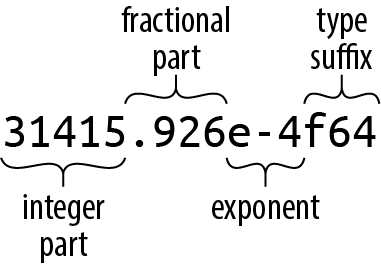
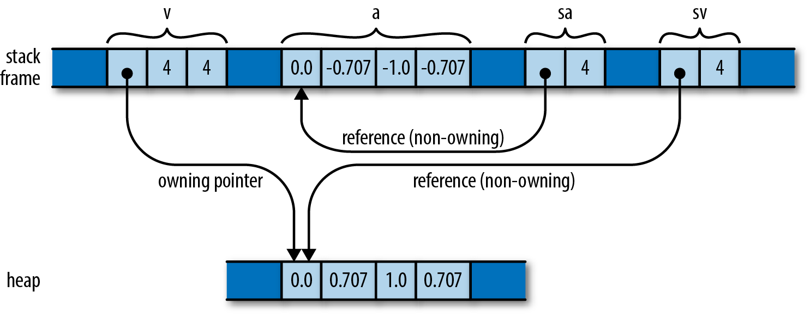

# 第3章. 基本类型

#### 第3章

## 基本类型

There are many, many types of books in the world, which makes good sense, because there are many, many types of people, and everybody wants to read something different. 

         —Lemony Snicket

 Rust的类型有几个目标：

> _安全_

 通过检查程序的类型，Rust编译器排除了所有类的常见错误。 通过使用类型安全的替代方法替换空指针和未检查的联合，Rust甚至能够消除其他语言中常见的崩溃根源错误。

> _效率_

 程序员可以精细地控制RUST程序如何表示内存中的值，并可以选择他们知道处理器将可以高效处理的类型。程序不必为了通用性和灵活性而牺牲性能。

> _简洁_

 Rust管理所有这些，而不需要程序员以代码中所写的类型的形式提供太多指导。 与类似的C++程序相比，Rust程序在类型上通常没有那么杂乱。

 Rust不是使用解释器或即时编译器，而是设计为使用静态编译：程序开始运行前，RUST程序已经编译成机器码了。 Rust的类型有助于编译器为您的程序操作的数据选择良好的机器级别优化编译： 您可以预测程序的运行性能，并使您能够完全访问计算机的功能。

 Rust是一种静态类型的语言： 在运行程序之前，编译器检查每个可能的执行路径是否只会以与它们的类型一致的方式使用此数据。这使得Rust能够及早发现许多编程错误，这对Rust的安全保证至关重要。

 与JavaScript或Python之类的动态类型语言相比，Rust需要您预先进行更多的设计和策划： 您必须详细说明函数的参数和返回值的类型、结构类型的成员以及其他一些构造函数。 然而，RUST的两个特性使它的繁琐比您预期的要少：

*  根据您写出的类型，Rust将为您推断出其余的大部分类型。 实际上，对于给定的变量或表达式，通常只有一种类型有效；在这种情况下，Rust允许您省略类型。 例如，你可以写出函数中的每一种类型，就像这样：

```rust
fn build_vector() -> Vec<i16> {
    let mut v: Vec<i16> = Vec::<i16>::new();
    v.push(10i16);
    v.push(20i16);
    v
}
```

 但这是混乱和重复的。 给定函数的返回类型，很明显v必须是一个Vec&lt;i16&gt;，一个16位有符号整数的vector；其他类型都不可以。 由此可以推出vector的每个成员值都必须是i16类型。 这正是Rust的类型推断的推断原理，它允许您改为这样写：

```rust
fn build_vector() -> Vec<i16> {
    let mut v = Vec::new();
    v.push(10);
    v.push(20);
    v
}
```

 这两个定义完全等价；两种不同的写法，但Rust将编译成相同的机器码。 类型推断在很大程度上实现了动态类型语言的易读性，同时仍然在编译时捕获类型错误。

*  函数可以是通用的：当函数的用途和实现足够通用时，可以将其定义为在满足必要条件的任何类型集上工作。 单个定义可以涵盖一组开放式的用例。

 在Python和JavaScript中，所有函数都以这种方式工作:函数可以对具有该函数所需的属性和方法的任何值进行操作。 \(这个特征通常被称为“鸭子类型”：如果它像鸭子一样嘎嘎叫，那它就是鸭子。\) 但正是这种灵活性使得这些语言很难及早发现类型错误；测试通常是捕捉此类错误的唯一方法。 Rust的泛型函数为该语言提供了一定程度的灵活性，同时仍然在编译时捕获所有类型错误。

 尽管泛型函数具有灵活性，但它们与非泛型函数一样高效。 我们将在第11章中详细讨论泛型函数。

 本章的其余部分将从头开始介绍Rust的类型，从简单的机器类型\(如整数和浮点值\)开始，然后展示如何将它们组合成更复杂的结构。在适当的情况下，我们将描述Rust如何在内存中表示这些类型的值，以及它们的性能特征。

 下面是您将在Rust中看到的各种类型的简述。 这张表显示了Rust的基本类型，一些来自标准库的非常常见的类型，以及一些用户定义类型的例子：

<table>
  <thead>
    <tr>
      <th style="text-align:left">Type</th>
      <th style="text-align:left">Description</th>
      <th style="text-align:left">Value</th>
    </tr>
  </thead>
  <tbody>
    <tr>
      <td style="text-align:left">
        <p>i8, i16, i32, i64,</p>
        <p>u8, u16, u32, u64</p>
      </td>
      <td style="text-align:left">有符号和无符号整数</td>
      <td style="text-align:left">
        <p>42, -5i8, 0x400u16, 0o100i16, 20_922_789_888_000u64,</p>
        <p>b'*' (u8 类型字节字面量)</p>
      </td>
    </tr>
    <tr>
      <td style="text-align:left">isize, usize</td>
      <td style="text-align:left">有符号和无符号整数，大小与机器上的地址相同(32或64位)</td>
      <td style="text-align:left">137, -0b0101_0010isize, 0xffff_fc00usize</td>
    </tr>
    <tr>
      <td style="text-align:left">f32, f64</td>
      <td style="text-align:left">IEEE浮点数，单精度和双精度</td>
      <td style="text-align:left">IEEE浮点数，单精度和双精度</td>
    </tr>
    <tr>
      <td style="text-align:left">bool</td>
      <td style="text-align:left">布尔型</td>
      <td style="text-align:left">true, false</td>
    </tr>
    <tr>
      <td style="text-align:left">char</td>
      <td style="text-align:left">Unicode字符，32位宽</td>
      <td style="text-align:left">'*', '\n', '字', '\x7f', '\u{CA0}'</td>
    </tr>
    <tr>
      <td style="text-align:left">(char, u8, i32)</td>
      <td style="text-align:left">元组：允许混合类型</td>
      <td style="text-align:left">('%', 0x7f, -1)</td>
    </tr>
    <tr>
      <td style="text-align:left">()</td>
      <td style="text-align:left">“unit”(空的)的元组</td>
      <td style="text-align:left">()</td>
    </tr>
    <tr>
      <td style="text-align:left">struct S { x: f32, y: f32 }</td>
      <td style="text-align:left">字段被命名的结构</td>
      <td style="text-align:left">S { x: 120.0, y: 209.0 }</td>
    </tr>
    <tr>
      <td style="text-align:left">struct T(i32, char);</td>
      <td style="text-align:left">元组结构</td>
      <td style="text-align:left">T(120, 'X')</td>
    </tr>
    <tr>
      <td style="text-align:left">struct E;</td>
      <td style="text-align:left">单位结构；没有字段</td>
      <td style="text-align:left">E</td>
    </tr>
    <tr>
      <td style="text-align:left">enum Attend { OnTime, Late(u32) }</td>
      <td style="text-align:left">枚举类型</td>
      <td style="text-align:left">Attend::Late(5), Attend::OnTime</td>
    </tr>
    <tr>
      <td style="text-align:left">Box
        <Attend>
      </td>
      <td style="text-align:left">Box：在堆中指向值的指针</td>
      <td style="text-align:left">Box::new(Late(15))</td>
    </tr>
    <tr>
      <td style="text-align:left">&i32, &mut i32</td>
      <td style="text-align:left">引用和可变引用：非所有权的指针，不能超过它们的声明周期</td>
      <td style="text-align:left">&s.y, &mut v</td>
    </tr>
    <tr>
      <td style="text-align:left">String</td>
      <td style="text-align:left">UTF-8字符串，可变大小</td>
      <td style="text-align:left">"ラーメン: ramen".to_string()</td>
    </tr>
    <tr>
      <td style="text-align:left">&str</td>
      <td style="text-align:left">引用str:非拥有权的指针utf - 8的文本，字符串的字面量类型</td>
      <td style="text-align:left">"そば: soba", &s[0..12]</td>
    </tr>
    <tr>
      <td style="text-align:left">[f64; 4], [u8; 256]</td>
      <td style="text-align:left">数组,固定长度；所有类型相同的元素</td>
      <td style="text-align:left">[1.0, 0.0, 0.0, 1.0], [b' '; 256]</td>
    </tr>
    <tr>
      <td style="text-align:left">Vec
        <f64>
      </td>
      <td style="text-align:left">vector,长度可变；所有类型相同的元素</td>
      <td style="text-align:left">vec![0.367, 2.718, 7.389]</td>
    </tr>
    <tr>
      <td style="text-align:left">&[u8], &mut [u8]</td>
      <td style="text-align:left">对切片的引用:对数组或vector的一部分的引用，包括指针和长度</td>
      <td style="text-align:left">&v[10..20], &mut a[..]</td>
    </tr>
    <tr>
      <td style="text-align:left">&Any, &mut Read</td>
      <td style="text-align:left">trait对象：引用实现给定方法集的任何值</td>
      <td style="text-align:left">value as &Any, &mut file as &mut Read</td>
    </tr>
    <tr>
      <td style="text-align:left">fn(&str, usize) -> isize</td>
      <td style="text-align:left">函数指针</td>
      <td style="text-align:left">i32::saturating_add</td>
    </tr>
    <tr>
      <td style="text-align:left">(Closure types have no written form)</td>
      <td style="text-align:left">闭包</td>
      <td style="text-align:left">|a, b| a<em>a + b</em>b</td>
    </tr>
  </tbody>
</table> 除以下内容外，本章将讨论这些类型中的大多数：

* 我们在第9章中给出了结构类型。
* 我们在第10章给出枚举类型。
*  我们在第11章中描述trait对象。
*  我们在这里描述String和&str的基本内容，但在 第17章会有更详细的介绍。
*  我们将在第14章中讨论函数和闭包类型。

### 机器类型

 Rust类型系统的基础是一组固定宽度的数字类型，选择这些类型是为了匹配几乎所有现代处理器直接在硬件中实现的类型，包括布尔型和字符型。

 Rust的数字类型的名称遵循一个规则模式，以位的形式写出它们的宽度，以及它们使用的表示形式：

| Size（bits） | Unsigned integer | Signed integer | Floating-point |
| :--- | :--- | :--- | :--- |
| 8 | u8 | i8 |  |
| 16 | u16 | i16 |  |
| 32 | u32 | i32 | f32 |
| 64 | u64 | i64 | f64 |
| Machine word | usize | isize |  |

 在这里，机器字是代码运行的机器上的地址大小的值，通常为32或64位。

### Integer类型

 Rust的无符号整数类型使用它们的全范围来表示正数和零：

| Type | Range |
| :--- | :--- |
| u8 | 0 to 28–1 \(0 to 255\) |
| u16 | 0 to 216−1 \(0 to 65,535\) |
| u32 | 0 to 232−1 \(0 to 4,294,967,295\) |
| u64 | 0 to 264−1 \(0 to 18,446,744,073,709,551,615, or 18 quintillion\) |
| usize | 0 to either 232−1 or 264−1 |

 Rust的有符号整数类型使用这两种类型的补码表示，使用与对应的无符号类型相同的位模式来覆盖正负值的范围：

| Type | Range |
| :--- | :--- |
| i8 | −27 to 27−1 \(−128 to 127\) |
| i16 | −215 to 215−1 \(−32,768 to 32,767\) |
| i32 | −231 to 231−1 \(−2,147,483,648 to 2,147,483,647\) |
| i64 | −263 to 263−1 \(−9,223,372,036,854,775,808 to 9,223,372,036,854,775,807\) |
| isize |  −231 to 231−1, 或者 −263 to 263−1 |

 Rust通常使用u8类型作为字节值。 例如从文件或套接字读取数据会产生u8类型数据流。

 与C和C++不同，Rust将字符与数字类型区别对待；char既不是u8也不是i8。我们在52页的“字符”中描述Rust的char类型。

 usize和isize类型类似于C和C++中的size\_t和ptrdiff\_t类型。usize类型是无符号的，isize是有符号的。 它们的精度取决于目标机器上地址空间的大小： 它们在32位架构上有32位长，在64位架构上有64位长。 Rust要求数组索引为usize类型。在某些数据结构中，表示数组或vector的大小或元素个数的计数的值通常也具有usize类型。

 在调试构建中，Rust检查算术中的整数溢出：

```rust
let big_val = std::i32::MAX;
let x = big_val + 1; // panic: arithmetic operation overflowed
```

 在一个发布版本中，这个加法会被包装成一个负数\(不像C++，有符号整数溢出是未定义的行为\)。 但是除非你想要永远放弃调试，否则要指望它是一个坏主意。 当你想要包装算法时，使用方法：

```rust
let x = big_val.wrapping_add(1); // ok
```

 RUST的整数字面量可以采取一个后缀表示它们的类型：42u8是一个u8值，1729isize是一个isize值。 在这种情况下，可以省略整数字面量的后缀Rust将尝试从上下文中推断它的类型。 这种推理通常标识一个惟一的类型，但有时几种类型中的任何一种都可以运行。 在这种情况下，如果有可能的话，Rust默认为i32。 否则Rust将类型歧义做为错误。

 前缀0x、0o和0b指定十六进制、八进制和二进制字面量。

 为了使长数字更清晰，可以在数字中插入下划线。 例如，可以将最大的u32值写成4\_294\_967\_295。 下划线的确切位置并不重要，因此可以将十六进制或二进制数字分成四组而不是三组，如0xffff\_ffff中所示，或者从数字中设置类型后缀，如127\_u8中所示。

 一些整数字面量的例子：

| Literal | Type | Decimal Value |
| :--- | :--- | :--- |
| 116i8 | i8 | 116 |
| 0xcafeu32 | u32 | 51966 |
| 0b0010\_1010 | Inferred | 42 |
| 0o106 | Inferred | 70 |

 虽然数字类型和char类型是不同的，但是Rust确实提供了字节字面量，u8值的类似字符的字面量：b' x ' 表示字符的ASCII码 X，作为u8的值。 因为A的ASCII码是65，所以文字b'A'和65u8完全相等。 只有ASCII字符可以以字节形式出现。

 有几个字符不能简单地放在单引号后面，因为这样会造成语法上的歧义或难以阅读。 以下字符需要在前面加上反斜杠：

| Character | Byte  literal | Numeric equivalent |
| :--- | :--- | :--- |
| Single quote, ' | b'\'' | 39u8 |
| Backslash, \ | b'\\' | 92u8 |
| Newline | b'\n' | 10u8 |
| Carriage return | b'\r' | 13u8 |
| Tab | b'\t' | 9u8 |

 对于难以编写或读取的字符，可以用十六进制来编写它们的代码。 形式b'\xHH'的字节字面量，其中HH是任意两位十六进制数，表示其值为HH的字节。 您可以将ASCII“转义”控制字符的字节字面量写成b'\x1b'，因为ASCII码的作用是“转义”是27，或用十六进制表示为1B。 由于字节字面量只是u8值的另一种表示法，考虑一个简单的数字字面量是否更清晰： 只有当你想强调这个值代表ASCII码时，使用b'\x1b'而不是简单的27才有意义。

 可以使用as操作符将一种整数类型转换为另一种整数类型。 我们将在139页的“类型强制转换”中解释转换是如何工作的，下面是一些示例：

```rust
assert_eq!( 10_i8 as u16, 10_u16); // in range
assert_eq!( 2525_u16 as i16, 2525_i16); // in range
assert_eq!( -1_i16 as i32, -1_i32); // sign-extended
assert_eq!(65535_u16 as i32, 65535_i32); // zero-extended
// Conversions that are out of range for the destination
// produce values that are equivalent to the original modulo 2^N,
// where N is the width of the destination in bits. This
// is sometimes called "truncation".
assert_eq!( 1000_i16 as u8, 232_u8);
assert_eq!(65535_u32 as i16, -1_i16);
assert_eq!( -1_i8 as u8, 255_u8);
assert_eq!( 255_u8 as i8, -1_i8);
```

 和其他类型的值一样，整数也可以有方法。 标准库提供了一些基本操作，您可以在在线文档中查找这些操作。 注意，文档包含类型的单独页面\( 搜索例如，“i32\(原语类型\)”\)，以及用于该类型的模块\(搜索例如，“std::i32”\)。例如：

```rust
assert_eq!(2u16.pow(4), 16); // exponentiation
assert_eq!((-4i32).abs(), 4); // absolute value
assert_eq!(0b101101u8.count_ones(), 4); // population count
```

 字面量的类型后缀在这里是必需的： Rust在知道一个值的类型之前不能查找它的方法。 然而，在实际代码中，通常有额外的上下文来消除类型的歧义，因此不需要后缀。

###  浮点类型

 Rust提供IEEE单精度浮点型和双精度浮点型。 根据IEEE 754-2008规范，这些类型包括正无穷和负无穷，不同的正零和负零值，以及非数字值：

| Type | Precition | Range |
| :--- | :--- | :--- |
| f32 | IEEE single precision \(at least 6 decimal digits\) | Roughly –3.4 × 1038 to +3.4 × 1038 |
| f64 | IEEE double precision \(at least 15 decimal digits\) | Roughly –1.8 × 10308 to +1.8 × 10308 |

 Rust的f32和f64对应于支持IEEE浮点数的C和C++实现中的单浮点数和双浮点数类型，以及总是使用IEEE浮点数的Java中的浮点数。

 浮点字面量的一般形式如图3-1所示.



 整数部分之后的浮点数的每个部分都是可选的，但是必须至少提供小数部分、指数或类型后缀中的一个，以便将其与整数文字区分开。 小数部分可以由一个单独的小数点组成，所以是5.是一个有效的浮点常量。

 如果浮点文字缺少类型后缀，Rust会根据上下文推断它是f32还是f64，如果可能的话，默认为f64。（ 类似地，C, C++，和  
Java都将无后缀的浮点字面量视为双精度浮点类型。） 出于类型推断的目的，Rust将整数字面量和浮点字面量视为不同的类：它永远不会为整数字面量推断浮点类型，反之亦然。

 浮点字面量的一些例子：

| Literal | Type | Mathematical value |
| :--- | :--- | :--- |
| –1.5625 | Inferred | −\(1 9⁄16\) |
| 2. | Inferred | 2 |
| 0.25 | Inferred | ¼ |
| 1e4 | Inferred | 10,000 |
| 40f32 | f32 | 40 |
| 9.109\_383\_56e-31f64 | f64 | Roughly 9.10938356 × 10–31 |

 标准库的std::f32和std::f64模块定义的IEEE要求的特殊常量值，如∞，-∞\(-∞\)，NAN以及MIN和MAX\(最大和最小的有限值\)。std::f32::consts和std::f64::consts模块提供各种常用的数学常量，如E、PI和根号2。

 f32和f64类型提供了完整的数学计算方法； 例如，2f64.sqrt\(\)是2的双精度平方根。 标准库文档以“f32\(原语类型\)”和“f64\(原语类型\)”的名称描述这些。一些例子：

```rust
assert_eq!(5f32.sqrt() * 5f32.sqrt(), 5.); // exactly 5.0, per IEEE
assert_eq!(-1.01f64.floor(), -1.0);
assert!((-1. / std::f32::INFINITY).is_sign_negative());
```

 和以前一样，通常不需要在实际代码中写出后缀，因为上下文将决定类型。 然而，如果没有后缀也无法从上下文推断类型，会报错误消息。 例如，下面的代码无法编译：

```rust
println!("{}", (2.0).sqrt());
```

RUST会报错误：

```bash
error: no method named `sqrt` found for type `{float}` in the current scope
```

 这可能有点令人困惑；除了浮点类型，还能在哪里找到sqrt方法呢？ 解决方法是用一种或另一种方式来说明你想要的类型：

```rust
println!("{}", (2.0_f64).sqrt());
println!("{}", f64::sqrt(2.0));
```

 与C和C++不同，Rust几乎不隐式执行任何数字转换。 如果函数需要一个f64参数，那么传递一个i32值作为参数就是一个错误。 实际上，Rust甚至不会隐式地将i16值转换为i32值，即使每个i16值也是i32值。 但这里的关键词是含蓄的： 您总是可以使用as操作符写出显式类型转换：i as f64, 或者 x as i32 。 由于缺乏隐式转换，有时RUST表达式比类似的C或c++代码更冗长。 然而，隐式整数转换有导致错误和安全漏洞的情况； 根据我们的经验，在Rust中写出数字转换的行为提醒了我们一些本来会忽略的问题。 我们将准确地解释转换在“Type”中的行为  
在139页。

### 布尔类型

 Rust的布尔类型bool通常有两个值，true和false。 比较运算符如==和&lt;产生bool结果： 2 &lt; 5的值为true。 许多语言对于在需要布尔值的上下文中使用其他类型的值比较宽松： C和C++隐式地转换字符、整数、浮点数和指向布尔值的指针，因此它们可以直接用作if或while语句中的条件。 Python允许在布尔上下文中使用字符串、列表、字典甚至集合，如果这些值是非空的，则将其视为true。 但是Rust非常严格：控制结构如if和while要求它们的条件是bool表达式，短路逻辑运算符&&和\|\|也是如此。你必须写 if x != 0 { ... }, 而不是简单的 if x { ... }。

 Rust的as操作符可以将bool值转换为整数类型：

```rust
assert_eq!(false as i32, 0);
assert_eq!(true as i32, 1);
```

 但是，as不会向另一个方向转换，从数值类型转换为bool。 相反，您必须写出一个显式的比较，如 x != 0 。

 虽然bool只需要一个位来表示它，但是Rust使用整个字节来表示内存中的bool值，因此您可以创建一个指向它的指针。

### 字符

 Rust的字符类型char表示单个Unicode字符，即32位值。

 Rust将char类型单独用于单个字符，但将UTF-8编码用于字符串和文本流。 因此，字符串将其文本表示为UTF-8字节，不是字符数组。

 字符字面量是用单引号括起来的字符，如“8”或“!”。 你可以使用任何Unicode字符，你喜欢： “錆”是代表日本汉字字符文字寂\(rust\)。

 与字节文字一样，反斜杠转义需要几个字符：

| Character | Rust character literal |
| :--- | :--- |
| Single quote, ' | '\'' |
| Backslash, \ | '\\' |
| Newline | '\n' |
| Carriage return | '\r' |
| Tab | '\t' |

 如果你愿意，你可以用十六进制写出一个字符的Unicode编码点:

*  如果字符的编码点在U+0000到U+007F之间（ 也就是说，如果它是从ASCII字符集中抽取的）， 然后可以将字符写成'\xHH'，其中HH是一个两位数的十六进制数。 例如，字符字面量 '\*' 和 '\x2A' 是相等的， 因为字符\*的编码点是42，或者用十六进制表示 2a  。
*  您可以将任何Unicode字符写成'\u{HHHHHH}'，其中HHHHHH是1到6位之间的十六进制数。 字符字面量“\ u { CA0 }”代表字符“ಠ”,埃纳德语字符中使用Unicode的不像，“ಠ\_ಠ”。 同样的字面量也可以简单地写成“ಠ”。

 char始终保存范围为0x0000到0xD7FF或0xE000到0x10FFFF的Unicode编码点。 char从来不是代理对的一半（ 也就是0 0 xdfff 到 xd800范围内的一个编码点）， 或Unicode编码库之外的值（那就是 大于  0 x10ffff）。 Rust使用类型系统和动态检查来确保char值始终在允许的范围内。

 Rust从不隐式地在char和任何其他类型之间进行转换。 可以使用as转换操作符将char转换为整数类型；对于小于32位的类型，字符值的上位被截断：

```rust
assert_eq!('*' as i32, 42);
assert_eq!('ಠ' as u16, 0xca0);
assert_eq!('ಠ' as i8, -0x60); // U+0CA0 truncated to eight bits, signed
```

 在另一个方向上，u8是as操作符将转换为char的唯一类型：  
Rust希望as操作符只执行廉价的、可靠的转换，但是除了u8之外的所有整数类型都包含不允许Unicode编码点的值，因此这些转换需要运行时检查。 相反，标准库函数std::char::from\_u32接受任何u32值并返回Option&lt;char&gt;： 如果u32不是一个允许的Unicode代码点，那么from\_u32返回None;否则，它返回一些\(c\)，其中c是char结果。

 标准库提供了一些关于字符的有用方法，您可以通过搜索“char\(原语类型\)”和模块“std::char”在联机文档中查找这些方法。 例如：

```rust
assert_eq!('*'.is_alphabetic(), false);
assert_eq!('β'.is_alphabetic(), true);
assert_eq!('8'.to_digit(10), Some(8));
assert_eq!('ಠ'.len_utf8(), 3);
assert_eq!(std::char::from_digit(2, 10), Some('2'));
```

 自然，单独的单个字符不像字符串和文本流那样有趣。 我们将在第64页的“字符串类型”描述Rust的标准字符串类型和文本处理。

###  元组

 元组是一对，三倍，四倍，…各种类型的值。 可以将元组写成元素序列，由逗号分隔，括号括起。 例如\(“Brazil”，1985\)是一个元组，其第一个元素是静态分配的字符串，第二个元素是整数；它的类型是\(&str, i32\)\(或者1985 Rust推断的任何整数类型\)。 给定一个元组值t，可以将其元素访问为t.0，t.1，以此类推。

 元组不太像数组:首先，元组的每个元素可以有不同的类型，而数组的元素必须都是相同的类型。 此外，元组只允许常量作为索引，如t.4。你不能写 t.i 或者 t\[i\] 来得到第 i 个元素。

 Rust代码经常使用元组类型从函数返回多个值。 例如，字符串片上的split\_at方法将一个字符串分成两半并返回它们，它的声明如下：

```rust
fn split_at(&self, mid: usize) -> (&str, &str);
```

 返回类型\(&str， &str\)是两个字符串片的元组。您可以使用模式匹配语法将返回值的每个元素赋给不同的变量：

```rust
let text = "I see the eigenvalue in thine eye";
let (head, tail) = text.split_at(21);
assert_eq!(head, "I see the eigenvalue ");
assert_eq!(tail, "in thine eye");
```

 这样更容易懂：

```rust
let text = "I see the eigenvalue in thine eye";
let temp = text.split_at(21);
let head = temp.0;
let tail = temp.1;
assert_eq!(head, "I see the eigenvalue ");
assert_eq!(tail, "in thine eye");
```

 您还会看到元组被用作一种极简结构类型。 例如，第2章中Mandelbrot程序，我们需要将图像的宽度和高度传递给绘制图像的函数并将其写入磁盘。 我们可以声明一个具有宽度和高度成员的结构体，但是对于一些很明显的东西，这是一个很重的符号，所以我们只使用了一个元组：

```rust
/// Write the buffer `pixels`, whose dimensions are given by `bounds`, to the
/// file named `filename`.
fn write_image(filename: &str, pixels: &[u8], bounds: (usize, usize))
-> Result<(), std::io::Error>
{ ... }
```

 边界参数的类型是\(usize, usize\)，它是两个usize值的元组。 不可否认，我们也可以写出单独的宽度和高度参数，而机器代码在这两种情况下都是一样的。这样写更清晰些。 我们认为边界是一个值，而不是两个，使用元组可以准确表达我们的意思。

 另一种常用的元组类型是\(\)，这可能令人惊讶。 这通常称为单元类型，因为它只有一个值，也就是write\(\)。 Rust在没有任何有意义的值的情况下使用单元类型，但是上下文仍然需要某种类型。

 例如，不返回值的函数的返回类型为\(\)。 标准库的std::mem::swap函数没有任何有意义的返回值；它只是交换了两个参数的值。 std::mem::swap声明为：

```rust
fn swap<T>(x: &mut T, y: &mut T);
```

 &lt;T&gt;意味着swap是泛型函数： 您可以在引用任何类型的值时使用它  
T。  但是签名完全省略掉swap的返回类型，这是返回单元类型的简写：

```rust
fn swap<T>(x: &mut T, y: &mut T) -> ();
```

 类似地，我们前面提到的write\_bitmap示例的返回类型为  
Result&lt;\(\)， std::io::Error&gt;，意思是如果出错，函数返回一个std::io::Error值，但如果成功则不返回任何值。

 如果愿意，可以在元组的最后一个元素后面加上逗号:类型\(&str,  i32,\)和\(&str,  i32\)是等价的，表达式\("Brazil", 1985,\)和\("Brazil",  1985\)也是等价的。 Rust始终允许在逗号使用的任何地方使用一个附加的逗号： 函数参数、数组、结构和枚举定义，等等。 对于人来说，这可能看起来很奇怪，但是当在列表的末尾添加和删除条目时，它可以更容易阅读。

 为了保持一致性，甚至还有包含单个值的元组。 \("lonely hearts",\) 是一个包含一个字符串的元组；它的类型是\(&str, \) 。 在这里，值后面的逗号是所必需的，它区分一个值元组和简单的括号表达式。

### 指针类型

 Rust有几种表示内存地址的类型。

 这是Rust和大多数使用垃圾收集语言之间的一个很大区别。 在Java中，如果类树包含一个字段树left;，那么left是另一个单独创建的树对象的引用。 对象在Java中从来不包含其他对象。RUST是不同的。 该语言旨在帮助将分配保持在最小限度。 默认情况下嵌套值。 值\(\(0, 0\)，\(1440, 900\)\)被存储为四个相邻的整数。 如果你把它存储在一个局部变量中，你会得到一个局部变量有四个整数宽。 堆中没有分配任何东西。

 这对于内存效率非常好，但是结果是，当一个Rust程序需要值指向其他值时，它必须显式地使用指针类型。 好消息是，在safe Rust中使用的指针类型被限制为消除未定义的行为，因此在Rust中正确使用指针要比在C++中容易得多。

 我们将在这里讨论三种指针类型:引用、Boxes和不安全指针。

### 引用

 &String 类型的值\(发音为“ref String”\)是对字符串值的引用，  
&i32是对i32的引用，以此类推。

 最简单的方法是将引用看作Rust的基本指针类型。 引用可以指向任何位置的任何值，堆栈或堆。 表达式&x产生对x的引用；在Rust术语中，我们说它借用了对x的引用。 给定一个引用r，表达式\*r表示r指向的值。 它们非常类似于C和C++中的&和\*操作符。 和C指针一样，引用在超出作用域时不会自动释放任何资源。

 但是，与C指针不同的是，Rust引用从来不是空的：在safe Rust中根本没有办法生成空引用。 默认情况下，Rust引用是不可变的：

```rust
&
```

                      不可变引用，比如C中的const T\*  。

```rust
&mut T
```

                      可变引用，比如C中的T\*。

 另一个主要区别是Rust跟踪值的所有权和生存周期，因此在编译时排除悬空指针、多次释放和指针失效等错误。 在第5章阐述了RUST的安全使用规则。

### Boxes

 在堆中分配值最简单的方法是使用Box::new：

```rust
let t = (12, "eggs");
let b = Box::new(t); // allocate a tuple in the heap
```

 t 的类型是\(i32， &str\)，所以b的类型是Box&lt;\(i32， &str\)&gt;。Box::new\(\)分配足够的内存来包含堆上的元组。 当b超出作用域时，内存将立即释放，除非b已被移动\(例如通过返回它\)。 对于RUST处理堆分配值的方式，移动是必不可少的；我们将在第4章详细解释这一切。

### 裸指针

 Rust还具有裸指针类型 \*mut T 和 \*const T 。 裸指针实际上就像++中的指针。 使用裸指针是不安全的，因为Rust不需要跟踪它所指向的内容。 例如，裸指针可能是null，或者它们可能指向已释放的内存，或者现在包含不同类型的值。 裸指针的使用，会造成所有典型的C++指针错误的出现。

 但是，您只能在不安全的代码块中对裸指针解引用。 一个不安全的代码块是Rust的高级语言特性的选择加入机制，它的安全性取决于程序员。 如果您的代码没有不安全的代码块\(或者那些块确实写对了\)，那么我们在本书中强调的安全保证仍然有效。 详情见第21章。

### Arrays, Vectors, and Slices

 Rust有三种类型，用于表示内存中的值序列：

*  类型\[T; N\]表示包含N个值的数组，每个值的类型为T。 数组的大小是在编译时确定的常量，是类型的一部分;不能添加新元素，也不能收缩数组。
*  类型Vec&lt;T&gt;，称为Ts的vector，是类型T的值的动态分配的可增长序列。 vector的元素位于堆中，因此您可以随意调整vector的大小：push新元素，追加其他vector，删除元素，等等。
*  类型&\[T\]和&mut \[T\]被称为Ts的共享切片和可变切片，它们是对一系列元素的引用，这些元素是其他值\(如array或vector\)的一部分。 可以将切片看作指向其第一个元素的指针，以及从该点开始可以访问的元素数量的计数。 可变切片 &mut \[T\]允许读取和修改元素，但不能共享；共享切片&\[T\]允许在多个读之间共享访问权限，但不允许修改元素。

 给定这三种类型中的任意一种的值v，表达式v.len\(\)给出v中元素的数量，v\[i\]表示v的第i个元素。 第一个元素是v\[0\]，最后一个元素是v\[v.len\(\) - 1\]。 RUST检查index是否总是在有效范围内；如果不是，表达式就会panics  。 v的长度可能是零，在这种情况下，任何索引它的尝试都会引起panics  。 i 必须是一个usize值；不能使用任何其他整数类型作为索引。

### Arrays

有几种写入数组值的方法。最简单的方法是在方括号中编写一系列值：

```rust
let lazy_caterer: [u32; 6] = [1, 2, 4, 7, 11, 16];
let taxonomy = ["Animalia", "Arthropoda", "Insecta"];

assert_eq!(lazy_caterer[3], 7);
assert_eq!(taxonomy.len(), 3);
```

 对于一个包含某个值的长数组的常见情况，可以写成\[V;  N\]其中V为每个元素应有的值，N为长度。 例如,\[true;  10000\]是一个包含10,000个bool元素的数组，全部设置为true：

```rust
let mut sieve = [true; 10000];
for i in 2..100 {
    if sieve[i] {
        let mut j = i * i;
        while j < 10000 {
            sieve[j] = false;
            j += i;
        }
    }
}

assert!(sieve[211]);
assert!(!sieve[9876]);
```

 您将看到这个语法用于固定大小的缓冲区：\[0u8; 1000\]可以是一个一千字节的缓冲区，用零字节填充。 Rust对于未初始化的数组没有符号。 \(一般来说，Rust确保代码永远不能访问任何类型的未初始化值。\)

 数组的长度是其类型的一部分，在编译时是固定的。 如果n是一个变量，就不能写成 \[true;  n\] 获取包含n个元素的数组。 当您需要一个长度在运行时发生变化的数组时\(通常是这样\)，使用vector代替。

 您希望在数组中看到的有用方法---遍历元素、搜索、排序、填充、过滤等等---都以切片的方法而不是数组的方法的形式出现。 但Rust在搜索方法时隐式地将对数组的引用转换为切片，因此您可以直接调用数组上的任何切片方法：

```rust
let mut chaos = [3, 5, 4, 1, 2];
chaos.sort();
assert_eq!(chaos, [1, 2, 3, 4, 5]);
```

 在这里，排序方法实际上是在片上定义的，但是由于排序通过引用获取其操作数，所以我们可以直接在chaos上使用它： 调用隐式地生成&mut \[i32\] 切片指向的是整个数组。 实际上，我们前面提到的len方法也是一个slice方法。 我们将在第62页的“切片”中更详细地介绍切片。

### Vectors

 vector  Vec&lt;T&gt;是类型为T的元素的可调整大小的数组，分配在堆上。

 有几种方法可以创建vector  。 最简单的是使用vec!宏，它给了我们一个vector的语法，看起来很像一个数组字面量：

```rust
let mut v = vec![2, 3, 5, 7];
assert_eq!(v.iter().fold(1, |a, b| a * b), 210);
```

 当然，这是一个vector，不是数组，所以我们可以动态地向它添加元素：

```rust
v.push(11);
v.push(13);
assert_eq!(v.iter().fold(1, |a, b| a * b), 30030);
```

 您还可以通过重复给定的值一定次数来构建一个vector，同样使用模仿数组字面量的语法：

```rust
fn new_pixel_buffer(rows: usize, cols: usize) -> Vec<u8> {
    vec![0; rows * cols]
}
```

 vec !宏相当于调用 Vec::new 来创建一个空vector，然后将元素推入其中，这是另一种习惯用法：

```rust
let mut v = Vec::new();
v.push("step");
v.push("on");
v.push("no");
v.push("pets");
assert_eq!(v, vec!["step", "on", "no", "pets"]);
```

 另一种可能性是从迭代器生成的值构建一个vector：

```rust
let v: Vec<i32> = (0..5).collect();
assert_eq!(v, [0, 1, 2, 3, 4]);
```

 在使用collect时通常需要提供类型\(正如我们在这里所做的\)，因为它可以构建许多不同类型的集合，而不仅仅是vector 。 通过使用 v 的显式类型，我们就明确了我们想要哪种类型的集合。

 和array一样，你可以在vector上使用slice方法：

```rust
// A palindrome!
let mut v = vec!["a man", "a plan", "a canal", "panama"];
v.reverse();
// Reasonable yet disappointing:
assert_eq!(v, vec!["panama", "a canal", "a plan", "a man"]);
```

 在这里，reverse方法实际上是在 slice 上定义的，但是调用隐式地从vector借用了一个 &mut \[&str\]  slice，并对其调用reverse 。

 Vec是RUST的一种基本类型——几乎在任何需要动态大小列表的地方都可以使用它——因此有许多其他方法可以构造新的vector或扩展现有的vector。我们将在第16章中讨论它们。

 Vec&lt;T&gt;由三个值组成： 指向堆分配缓冲区的指针，该缓冲区为保存元素而分配的；缓冲区能够存储的元素的数量；以及它现在包含的元素数\(换句话说，它的长度\)。 当缓冲区达到其容量时，向vector中添加另一个元素需要分配更大的缓冲区，将当前内容复制到其中，更新vector指针和容量以描述新缓冲区，最后释放旧缓冲区。

 如果你事先知道一个vector需要的元素个数，一开始，而不用调用Vec::new，而是调用Vec::with\_capacity来创建一个具有足够大的缓冲区来容纳所有数据的vector；然后，您可以一次向vector添加1个元素，而不会导致任何重新分配内存。 vec ! 宏使用了这样的技巧，因为它知道最终vector将包含多少元素。 注意，这只确定了vector的初始大小；如果超出了估计，这个vector就会像平常一样增大它的存储空间。

 许多库函数都在寻找使用Vec::with\_capacity的机会，而不是使用Vec::new 。 例如，在collect示例中，迭代器0..5预先知道它将产生5个值，collect函数利用这个值预先分配它返回的具有正确容量的vector。 我们将在第15章中看到它是如何工作的。

 就像vector的len方法返回它现在包含的元素数量一样，它的capacity方法返回它在不重新分配的情况下可以容纳的元素数量：

```rust
let mut v = Vec::with_capacity(2);
assert_eq!(v.len(), 0);
assert_eq!(v.capacity(), 2);

v.push(1);
v.push(2);
assert_eq!(v.len(), 2);
assert_eq!(v.capacity(), 2);

v.push(3);
assert_eq!(v.len(), 3);
assert_eq!(v.capacity(), 4);
```

 您将在代码中看到的容量可能与这里显示的不同。Vec和系统的堆分配器可能会收集请求，即使在with\_capacity情况下也是如此。

 您可以在vector中任意位置插入和删除元素，尽管这些操作将插入点之后的所有元素向前或向后移动，因此如果vector很长，它们可能很慢：

```rust
let mut v = vec![10, 20, 30, 40, 50];

// Make the element at index 3 be 35.
v.insert(3, 35);
assert_eq!(v, [10, 20, 30, 35, 40, 50]);

// Remove the element at index 1.
v.remove(1);
assert_eq!(v, [10, 30, 35, 40, 50]);
```

 您可以使用pop方法删除最后一个元素并返回它。更准确地说，从Vec&lt;T&gt;取出一个值会返回一个Option&lt;T&gt;： 如果vector已经为空，则为None；如果最后一个元素为v，则为Some\(v\)：

```rust
let mut v = vec!["carmen", "miranda"];
assert_eq!(v.pop(), Some("miranda"));
assert_eq!(v.pop(), Some("carmen"));
assert_eq!(v.pop(), None);
```

 你可以使用for循环来迭代一个vector：

```rust
// Get our command-line arguments as a vector of Strings.
let languages: Vec<String> = std::env::args().skip(1).collect();
for l in languages {
    println!("{}: {}", l,
             if l.len() % 2 == 0 {
                 "functional"
             } else {
                 "imperative"
             });
}
```

 用一组编程语言运行这个程序很有启发性：

```bash
$ cargo run Lisp Scheme C C++ Fortran
   Compiling fragments v0.1.0 (file:///home/jimb/rust/book/fragments)
     Running `.../target/debug/fragments Lisp Scheme C C++ Fortran`
Lisp: functional
Scheme: functional
C: imperative
C++: imperative
Fortran: imperative
$
```

 最后，给出了一个令人满意的函数式语言的定义。

 尽管vector是很基础的，但是在Rust中定义成一种普通类型，而不是内置在语言中。 我们将在本21章中介绍实现此类类型所需的技术。

###  一个元素一个元素地构造vector

 一次构建一个向量元素并不像听起来那么糟糕。 每当一个vector超出其缓冲区的容量时，它就会选择一个比旧缓冲区大两倍的新缓冲区。 假设这个vector从一个只能容纳一个元素的缓冲区开始：当它增长到它的最终容量时，它的缓冲区的大小为1、2、4、8，以此类推，直到它的最终大小为2n。 如果你考虑2的幂函数是如何工作的，你会发现之前所有较小缓冲区的总大小加起来是2n-1，非常接近最终缓冲区的大小。 由于实际元素的数量至少是缓冲区大小的一半，所以vector对每个元素执行的拷贝总是小于2次！

 这意味着使用Vec::with\_capacity而不是Vec::new是一种在速度上获得常数因子改进的方法，而不是一种算法改进。 对于小的vector，避免对堆分配器的一些调用可以显著地提高性能。

### Slices

 一个slice, 写成 \[T\] 没有指定长度的slice是array或vector的一个区域。 因为slice可以是任意长度的，所以slice不能直接存储在变量中或作为函数参数传递。slice总是通过引用传递。

对slice的引用是一个胖指针：一个两个word的值，包含一个指向slice的第一个元素的指针，以及slice中元素的数量。

假设您运行以下代码：

```rust
let v: Vec<f64> = vec![0.0, 0.707, 1.0, 0.707];
let a: [f64; 4] = [0.0, -0.707, -1.0, -0.707];

let sv: &[f64] = &v;
let sa: &[f64] = &a;
```

在最后两行中，Rust自动转换&Vec引用并且 &\[f64;4\]引用slice引用直接指向数据。

最后，内存如图3-2所示。



普通引用是指向单个值的非拥有指针，而对slice的引用是指向多个值的非拥有指针。这使得当您想要编写一个对任何相同类型数据序列\(无论是存储在array、vector、stack还是heap中\)进行操作的函数时，slice引用是一个很好的选择。例如，这是一个函数，它打印一段数字，每行一个：

```rust
fn print(n: &[f64]) {
    for elt in n {
        println!("{}", elt);
    }
}

print(&v); // works on vectors
print(&a); // works on arrays
```

因为这个函数以一个slice引用作为参数,所以可以将其应用于一个vector或一个array，如图所示。事实上，许多方法可以认为属于vector或array的方法实际上是在slice上定义的方法：例如这种排序和反转方法，它们可以对元素进行排序或反转，实际上是对slice类型\[T\]的方法。

你可以得到一个array或vector的slice的引用，或一个现有slice的slice，通过索引它的范围：

```rust
print(&v[0..2]); // print the first two elements of v
print(&a[2..]); // print elements of a starting with a[2]
print(&sv[1..3]); // print v[1] and v[2]
```

与普通数组访问一样，Rust检查索引是否有效。试图借用超出数据末尾的部分会导致一个panic错误。

我们经常使用术语slice来表示引用类型，比如&\[T\]或&str，但这只是一种简写:它们被正确地称为对slice的引用。由于slices几乎总是出现在引用后面，所以我们对更常见的概念使用更短的名称。

### String 类型

熟悉c++的程序员会记得该语言中有两种字符串类型。字符串字面量的指针类型为const char \*。标准库还提供了一个类std::string，用于在运行时动态创建字符串。

Rust也有类似的设计。在本节中，我们将展示编写字符串字面量的所有方法，然后介绍Rust的两种字符串类型。我们在第17章中提供了关于字符串和文本处理的更详细介绍。

#### String字面量

字符串字面量用双引号括起来。它们使用与字符字面量相同的反斜杠转义序列：

```rust
let speech = "\"Ouch!\" said the well.\n";
```

在字符串字面量中，与字符字面量不同，单引号不需要反斜杠转义，而双引号则需要。

一个字符串可以跨越多行：

```rust
println!("In the room the women come and go,
    Singing of Mount Abora");
```

字符串字面量中的换行字符包含在字符串中，因此也包含在输出中。第二行开头的空格也是如此。如果字符串的一行以反斜杠结束，那么换行符和下一行的前导空格将被删除：

```rust
println!("It was a bright, cold day in April, and \
    there were four of us—\
    more or less.");
```

这将打印一行文本。字符串包含“and”和“there”之间的单个空格 ，因为程序中反斜杠前有空格，破折号后没有空格。

在一些情况下，需要将字符串中的每个反斜杠都加倍是很麻烦的。\(典型的例子是正则表达式和Windows路径。\) 对于这些情况，Rust提供raw string。raw strng 用小写字母r标记。raw string 中的所有反斜杠和空格字符都被完整地包含在字符串中。无法识别转义序列。

```rust
let default_win_install_path = r"C:\Program Files\Gorillas";
let pattern = Regex::new(r"\d+(\.\d+)*");
```


